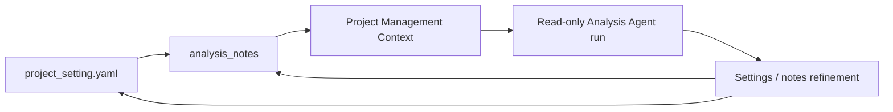

# v0.2 Project Settings And Pilot Readiness Design

## Purpose

v0.2 focuses on stabilizing an internal analyst pilot for the OAI Builder App.
The runtime foundation is already OpenAI Agents SDK. The product question for
v0.2 is narrower:

> Can an analyst use `project_setting.yaml` and analysis notes to give the
> agent enough business/data context to run one real BDR routing pilot analysis
> safely in read-only mode?

The previous scenario-bundle generator design remains useful, but it is not
the v0.2 product. The root roadmap moves v0.2 away from generated scenario
bundles and toward Project Settings + Analysis Notes as the contract. Manual
analyst traces and golden cases remain important, but they are v0.4 work.

## Goals

- Keep `project_setting.yaml` as the minimal analyst-editable payload:
  business background, analysis notes, and Databricks resource hints.
- Make analysis notes the pilot tuning surface for metric definitions,
  caveats, validation checks, rejected paths, and decision-owner expectations.
- Ensure project settings and notes are deterministically injected into
  developer and user-preview runs.
- Stabilize read-only/user-preview runs for internal analysts.
- Preserve the bundle-generator idea as a future materialization path, without
  making generated artifacts a v0.2 release gate.

## Non-Goals

- Replacing the OpenAI Agents SDK runtime from v0.1.
- Rebuilding the whole frontend.
- Requiring analysts to author `business_context.yaml`, `data_context.yaml`,
  or `analysis_context.yaml`.
- Shipping six-file scenario-bundle generation as a v0.2 requirement.
- Building manual analyst trace workflows or golden cases; revisit those in
  v0.4.
- Solving all charting, dashboarding, reporting, sharing, or row-level
  permission workflows.
- Treating SQL parser hardening, chart rendering, or answer manifests as the
  primary v0.2 deliverable.

## Pilot Runtime Contract

The v0.2 pilot path is:



The runtime contract is intentionally small:

| Input | Stored in | Runtime use |
|---|---|---|
| Business background | `project_setting.yaml.business_background` | Project purpose and scenario context. |
| Analysis notes | `project_setting.yaml.analysis_notes` and `settings.semantics.known_caveats` | Analyst tuning context, caveats, metric definitions, required checks, and feedback. |
| Databricks resources | `project_setting.yaml.databricks_resources` and `settings.resources` | Selected cluster, warehouse, schema, workspace folder, preferred tables, metric views, and output schema. |
| Operating rules | `AGENTS.md` | Mechanism guidance only: workflow, validation standards, escalation, output conventions. |

## Current OAI Baseline

The OAI app already implements the core project-setting foundation:

- `server/services/project_settings.py` defines `ProjectSetting` and
  `DatabricksResources`.
- The service renders, parses, creates, reads, writes, and validates
  `project_setting.yaml`.
- `server/routers/projects.py` exposes get/save/parse/validate routes.
- The Project Management panel imports, saves, and validates project settings.
- Saving project settings maps resource hints into persisted project settings.
- `analysis_notes` map into `settings.semantics.known_caveats`.
- `server/services/system_prompt.py` renders known caveats in Project
  Management Context.
- User-preview roles use read-only project context and filtered tool surfaces.

This means v0.2 should harden and validate the existing flow before adding a
new artifact generator.

## Minimal Project Setting Schema

`project_setting.yaml` should stay minimal and user-friendly. It should not ask
analysts to structure every metric, period, grain, answer rule, generated
artifact, or agent policy.

```yaml
business_background: >-
  Natural-language scenario, objective, decision context, key questions, and
  expected outcome. This can be incomplete or informal.

analysis_notes:
  # Optional free-form notes, assumptions, known dates, caveats, business
  # rules, metric definitions, validation checks, rejected paths, or feedback.
  - string

databricks_resources:
  databricks_host: string | null
  cluster_id: string | null
  warehouse_id: string | null
  workspace_folders: string[]
  workspace_files: string[]
  workflows: string[]
  input_schemas: string[]
  input_tables: string[]
  input_metric_views: string[]
  input_volume_paths: string[]
  output_schema: string | null
  output_volume_folders: string[]
```

Resource format guidance:

- `input_schemas`: preferred `<catalog.schema>`.
- `input_tables`: preferred `<catalog.schema.table>`.
- `input_metric_views`: preferred `<catalog.schema.metric_view>`.
- `input_volume_paths`: preferred
  `/Volumes/<catalog>/<schema>/<volume>/<path_or_file>`.
- `output_schema`: preferred `<catalog.schema>`.
- `output_volume_folders`: preferred
  `/Volumes/<catalog>/<schema>/<volume>/<folder>`.

All resources are hints until validated. The agent should inspect schema before
analytical SQL and should ask for clarification when selected resources are
partial, malformed, inaccessible, or insufficient.

## Analysis Notes Contract

Analysis notes are the main pilot tuning surface. They stay free-form in v0.2,
with these supported pilot categories:

- Metric definitions and preferred formulas.
- Required filters and exclusions.
- Known caveats and data quality warnings.
- Canonical validation checks.
- Rejected paths from manual analysis.
- Decision-owner expectations and rollout thresholds.
- Follow-up feedback from read-only agent runs.

The app currently stores notes as `known_caveats`. That is acceptable for v0.2
as long as prompt rendering makes them visible and analysts understand they are
the durable context channel. A later release can introduce typed note
categories after pilot usage shows which structure is worth enforcing.

## Project Operating Guide Contract

`AGENTS.md` is mechanism guidance, not payload. It may contain:

- workflow conventions and step ordering
- SQL validation standards and evidence requirements
- escalation rules for ambiguity or missing context
- output conventions that should persist across chats
- project-specific guardrails for when files or Databricks resources may be
  created or modified

It must not duplicate `project_setting.yaml`, generated YAML, Databricks
resource inventories, one-off query findings, conversation summaries, or final
analysis results. Updating project settings or notes should not automatically
copy payload into `AGENTS.md`.

## Read-Only Analyst Pilot Contract

User-preview/read-only runs should:

- Load project settings and analysis notes before planning.
- Use selected resources before broad discovery.
- Inspect schema before analytical SQL against configured tables or metric
  views.
- Expose read-oriented tools only.
- Avoid project-file and Databricks resource mutation.
- Return missing-context feedback when notes/settings are insufficient.

Read-only runs should not:

- Update `project_setting.yaml` automatically.
- Rewrite analysis notes without analyst approval.
- Create Databricks resources.
- Treat a draft YAML fixture as a runtime-certified bundle.

## Role Of Reference Bundle Artifacts

The existing BDR folder contains:

- `project_setting.yaml`
- `README.md`
- `business_context.yaml`
- `data_context.yaml`
- `analysis_context.yaml`
- `evals.yaml`

For v0.2, only `project_setting.yaml` is the active runtime payload. The other
files are reference scaffolding:

- They document the earlier bundle-generator concept.
- They help define expected business/data/analysis context.
- They provide a starting point for v0.4 manual traces and golden cases.
- They are not required runtime inputs for pilot success.

This keeps the original idea available without making the pilot depend on a
generator that does not exist yet.

## Deferred Bundle Generator

The future bundle generator can still be useful when the project needs
structured artifacts or reusable templates. A future generator should:

- Convert project settings and analysis notes into structured business,
  data, analysis, and eval artifacts.
- Preserve analyst-authored notes and any future reviewed golden cases.
- Ask targeted clarification questions for missing decision-critical context.
- Use bounded source-code and Databricks metadata enrichment.
- Support partial regeneration and review-state invalidation.

The generator should not be part of the v0.2 tag criteria.

## BDR Pilot Stabilization

The BDR routing pilot remains the seed scenario. The project setting should
carry:

- business objective and rollout decision context
- pilot and baseline periods
- test/control group notes and exclusions
- selected cluster and warehouse
- workspace source folder or notebook
- preferred schema/table or metric views
- output schema
- known metric definitions and validation caveats in analysis notes

## Validation Gates

v0.2 is stable enough for analyst pilot when:

- Project-setting schema/API/UI tests pass.
- `analysis_notes` round-trip and render in prompt context.
- BDR project settings validate against the target workspace or report clear
  warnings/errors.
- User-preview/read-only tool exposure is verified.
- One BDR read-only run uses configured resources and notes.
- Missing-context feedback has a path back into analysis notes.
- `scripts/v02_pilot_readiness.py` records the project id, setting path,
  selected resources, validation result, run role, trace id, and write-tool
  exposure/invocation evidence for the pilot run.

## Pilot Decisions And Remaining Manual Gates

- Analysis notes remain a list of strings for v0.2.
- The seed smoke-test question is: "Did the ML routing pilot perform well
  enough to roll out?"
- A pilot can proceed when validation either passes or records explicit
  warnings/errors that the analyst accepts for the run, such as stopped compute
  that can be started through normal workspace procedures.
- Missing-context feedback should be reviewed by the analyst before it becomes
  durable analysis notes.
