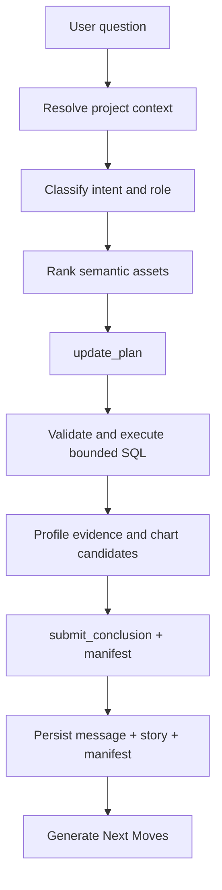

# v0.2 Business Analysis Design

## Purpose

v0.2 turns `databricks-builder-app-oai` from a general Databricks builder agent
into a more reliable business-question answering surface. The runtime migration
from v0.1 remains valid; this phase adds the contracts needed for correctness,
efficiency, replay, and evaluation.

The product target is not "run SQL and summarize." A business answer must show
what metric or table definition was used, which filters and grain were applied,
what evidence supports the conclusion, what caveats remain, and which follow-up
actions are safe for the current role.

## Goals

- Persist project resource defaults from every settings surface that displays
  them.
- Persist structured `submit_conclusion` output as the durable assistant answer.
- Add a machine-readable evidence manifest for each completed business answer.
- Enforce parser-based read-only SQL classification and bounded query policy.
- Add a semantic answering lane before SQL generation.
- Implement first-pass chart evidence for tabular SQL results.
- Add business-question evals that score quality and latency.
- Keep the existing OpenAI Agents SDK runtime boundary, SSE contract, and Story
  Canvas architecture unless an additive change is required.

## Non-Goals

- Replacing the OpenAI Agents SDK runtime from v0.1.
- Rebuilding the whole frontend.
- Normalizing all project settings into first-class tables in this phase.
- Granting access beyond Databricks workspace and Unity Catalog permissions.
- Shipping user-facing write actions in read-only/user-preview mode.
- Solving all dashboard/report authoring workflows.

## Business Answer Contract

Every completed business answer should have two durable records:

1. A normal assistant message containing the user-visible answer.
2. A structured manifest linked to the execution/story.

```typescript
interface BusinessAnswerManifest {
  version: 1;
  question: string;
  answerSummary: string;
  status: 'complete' | 'partial' | 'error';
  sources: EvidenceSource[];
  metrics: MetricUse[];
  filters: AnswerFilter[];
  grain?: string;
  timeBounds?: { start?: string; end?: string; timezone?: string };
  rowBounds?: { rowsRead?: number; rowsReturned?: number; limitApplied?: number };
  freshness?: Array<{ source: string; observedAt?: string; caveat?: string }>;
  assumptions: string[];
  caveats: string[];
  confidence: 'high' | 'medium' | 'low';
  replay: {
    executionId?: string;
    storyId?: string;
    traceId?: string;
    queryIds?: string[];
  };
}

interface EvidenceSource {
  id: string;
  type: 'table' | 'metric_view' | 'query' | 'file' | 'tool';
  name: string;
  uri?: string;
  sql?: string;
  columns?: string[];
  rationale?: string;
}

interface MetricUse {
  name: string;
  definition?: string;
  source?: string;
  aggregation?: string;
}

interface AnswerFilter {
  field: string;
  op: string;
  value: string;
}
```

The manifest can start as JSON stored with execution/story metadata. It should
later be promoted into normalized tables if queryability becomes important.

## Runtime Flow



### 1. Resolve Project Context

The router already builds project context from project settings, conversation
overrides, resource defaults, release state, and run role. v0.2 tightens this:

- Project Management resource fields must save to `settings.resources`.
- User-preview runs should pin to the release snapshot when present.
- Effective resources must be included in trace metadata and the answer
  manifest.
- Missing catalog/schema/warehouse should become a visible setup warning before
  broad discovery runs.

### 2. Semantic Answering Lane

Before broad SQL exploration, the runtime should narrow the data surface:

- Rank candidate assets from preferred tables, metric views, sample queries,
  glossary terms, deprecated tables, project memory, and recent conversation.
- Prefer governed metric views and certified/preferred tables.
- Explain why an asset was chosen in the evidence manifest.
- Fall back to metadata discovery only when project context is insufficient.

Initial implementation can be deterministic heuristics plus prompt context. A
later implementation can add a schema/profile cache and embedding search.

### 3. SQL Guardrails

`execute_sql` should enforce policy before hitting the warehouse:

- Parse SQL for statement type instead of checking string prefixes.
- Block writes, DDL, grants, external calls, and multi-statement mutation in
  read-only/user-preview mode.
- Require or inject a bounded `LIMIT` for exploratory queries.
- Validate catalog/schema resolution against effective resources.
- Optionally run `EXPLAIN` or a dry validation for complex queries.
- Capture query text, row bounds, warehouse, catalog/schema, and timing in the
  evidence manifest.

### 4. Evidence and Visualization

Tool results should become structured evidence, not only raw payloads:

- SQL rows/tables become table evidence with a source ID.
- Chartable SQL result sets receive a `ChartSpec` using the contract from
  `../data-visualization.md`.
- Every chart must keep a table fallback.
- Source metadata and caveats should be visible in the inspector.

### 5. Synthesis and Persistence

`submit_conclusion` is the canonical final-answer tool. v0.2 should make it
durable:

- `synthesis.appended.summary` becomes the assistant message content when no
  normal text answer exists.
- Highlights and next steps are persisted with story/execution metadata.
- The manifest is persisted before `next_moves.updated` generation.
- Replay should reconstruct the story from durable messages, execution events,
  and manifest, not only from the latest in-memory stream.

### 6. Next Moves

The current Next Moves service should remain the backend generator. v0.2 changes
its input quality:

- Use persisted conclusion summary if `final_text` is empty.
- Include manifest summaries rather than raw tool payloads.
- Respect run role and release state.
- Add latency metadata and fallback reason to events.

## Frontend Impact

The Story Canvas remains the primary UI. v0.2 adds fields and renderers:

- Show answer confidence, assumptions, caveats, sources, and row/time bounds.
- Render chart evidence when `EvidenceBlock.chartSpec` is present.
- Let users toggle chart/table evidence.
- Link evidence blocks to SQL/source entries in the manifest.
- Keep raw payloads in the inspector, not the story body.

## Evaluation

Business-question eval cases should be source-controlled fixtures. Each case
should include:

- user question
- project settings fixture
- expected source/table or metric choice
- expected SQL properties, not necessarily exact SQL text
- expected evidence requirements
- expected caveats or ambiguity handling
- latency/tool-call budget

Metrics:

- table/metric selection accuracy
- SQL safety classification
- SQL result sufficiency
- caveat/source completeness
- final answer usefulness
- time to first plan
- time to first evidence
- total model/tool calls

## Efficiency Budgets

Initial budgets for common business questions:

| Metric | Target |
|---|---|
| Time to first plan | <= 3 seconds after model stream starts |
| Time to first evidence | <= 20 seconds for metadata or small SQL |
| Tool calls before first SQL | <= 4 for scoped questions |
| SQL rows returned by default | <= 1,000 unless explicitly requested |
| Next Moves generation | <= configured timeout with heuristic fallback |

These are targets, not hard product promises. They should be measured in evals
and logs.

## Security and Governance

- Databricks permissions remain authoritative.
- Project settings narrow scope but do not grant platform access.
- Read-only/user-preview mode must receive read-oriented tools only.
- SQL safety must be enforced in code, not only in prompts.
- Model prompts and logs must not include Databricks tokens or model secrets.
- Release-pinned user sessions must not silently follow mutable draft settings.

## Relationship to Other Docs

- v0.1 runtime migration: `../v0.1-agents-sdk-integration/`
- Planning contract: `../planning-orchestration.md`
- Visualization contract: `../data-visualization.md`
- Project model: `../project-management/`
- Next Moves: `../next-moves/`
- Frontend story surface: `../frontend-refactor/`

## Open Questions

- Should the business-answer manifest be stored on `executions`, a new
  `stories` table, or both?
- Should semantic asset ranking be deterministic first, model-assisted first,
  or driven by a dedicated retrieval index?
- Which SQL parser should be used for Databricks SQL dialect coverage?
- Should chart detection be entirely client-side for phase 1, or should the
  backend emit model-guided chart specs with the evidence manifest?
- What is the smallest eval set that catches the highest-risk regressions?
