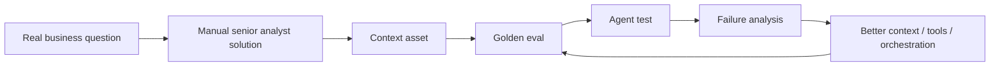
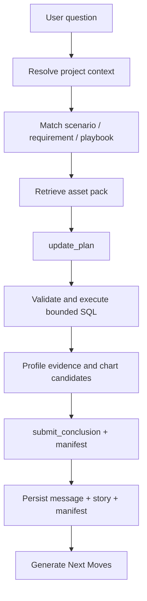

# v0.2 Business Analysis Design

## Purpose

v0.2 turns `databricks-builder-app-oai` from a general Databricks builder agent
into a more reliable business-question answering surface. The runtime migration
from v0.1 remains valid, but the next phase should not start from "how to build
an analyst agent." It should start from how the business asks analytical
questions and how senior human analysts answer them.

The product target is not "run SQL and summarize." A business answer must show
what metric or table definition was used, which filters and grain were applied,
what evidence supports the conclusion, what caveats remain, and which follow-up
actions are safe for the current role.

## Goals

- Persist project resource defaults from every settings surface that displays
  them.
- Persist structured `submit_conclusion` output as the durable assistant answer.
- Model the full business-analysis lifecycle from scenario to golden eval.
- Convert business requirements into reusable data assets, context assets, and
  analysis playbooks.
- Capture manual senior analyst execution as the source of truth for expected
  evidence and reasoning.
- Construct golden evals from manual analyst runs before optimizing agent
  orchestration.
- Add a machine-readable evidence manifest for each completed business answer
  once the analyst evidence contract is understood.
- Enforce parser-based read-only SQL classification and bounded query policy as
  part of trusted execution.
- Add semantic and context asset retrieval before SQL generation.
- Implement chart evidence where the human analyst process shows that visual
  shape matters.
- Benchmark agent orchestration against golden evals.
- Keep the existing OpenAI Agents SDK runtime boundary, SSE contract, and Story
  Canvas architecture unless an additive change is required.

## Non-Goals

- Replacing the OpenAI Agents SDK runtime from v0.1.
- Rebuilding the whole frontend.
- Normalizing all project settings into first-class tables in this phase.
- Granting access beyond Databricks workspace and Unity Catalog permissions.
- Shipping user-facing write actions in read-only/user-preview mode.
- Solving all dashboard/report authoring workflows.

## Lifecycle Model

The core v0.2 design object is the analysis lifecycle:


Each step produces durable artifacts that should be visible to the product and
testable in source control.

| Lifecycle step | Durable artifact | Why it matters |
|---|---|---|
| Business Scenario | Scenario brief | Captures the business decision, audience, operating cadence, and what action the answer should support. |
| Business Analysis Requirement | Requirement spec | Defines question variants, metric definitions, grain, filters, time windows, ambiguity rules, and acceptable caveats. |
| Data + Context Asset Preparation | Asset pack | Names tables, metric views, joins, glossary terms, caveats, ownership, freshness expectations, and access constraints. |
| Analysis Strategy / Method Selection | Playbook | Chooses methods such as metric lookup, variance analysis, trend, segmentation, cohort, funnel, root cause, data quality, or anomaly scan. |
| Manual Senior Analyst Execution | Analyst trace | Records the human analyst's SQL, intermediate checks, rejected paths, assumptions, evidence, charts, and final reasoning. |
| Golden Eval Construction | Golden eval case | Converts the analyst trace into expected source choices, SQL properties, evidence requirements, caveats, and answer rubric. |
| Agent Benchmark + Orchestration Design | Benchmark report and orchestration changes | Measures agent behavior against the golden case and only then changes tools, prompts, routing, or UI contracts. |

## Lifecycle Artifact Contracts

The first implementation can store these as Markdown/JSON fixtures. They can be
promoted into project settings or database tables after the shape stabilizes.

```typescript
interface BusinessScenario {
  id: string;
  name: string;
  decisionOwner: string;
  businessDecision: string;
  recurringQuestions: string[];
  decisionFrequency: string;
  businessImpact: string;
  requiredConfidence: 'low' | 'medium' | 'medium to high' | 'high';
  actionabilityRequirement: string;
  successCriteria: string[];
  nonGoals?: string[];
}

type AnalysisRequirementType =
  | 'metric_lookup'
  | 'monitoring_variance'
  | 'diagnostic_decomposition'
  | 'segment_discovery'
  | 'driver_analysis'
  | 'causal_experiment'
  | 'forecasting'
  | 'recommendation_optimization';

interface BusinessAnalysisRequirement {
  id: string;
  scenarioId: string;
  requirementType: AnalysisRequirementType;
  canonicalQuestion: string;
  questionVariants: string[];
  businessIntent: string;
  decisionToSupport: string;
  metrics: string[];
  dimensions: string[];
  filters: AnswerFilter[];
  grain?: string;
  timeWindow?: string;
  comparisonBaseline?: string;
  population?: string;
  expectedOutput: string[];
  ambiguityRules: string[];
  requiredCaveats: string[];
}

interface AnalysisAssetPack {
  id: string;
  requirementId: string;
  tables: EvidenceSource[];
  metricViews: EvidenceSource[];
  joins: Array<{ left: string; right: string; condition: string; caveat?: string }>;
  glossary: Record<string, string>;
  metricDefinitions: string[];
  canonicalSqlExamples: string[];
  validationChecklists: string[];
  dataCaveats: string[];
  freshnessExpectations: string[];
  accessConstraints: string[];
}

interface AnalysisPlaybook {
  id: string;
  requirementId: string;
  method:
    | 'metric_lookup'
    | 'monitoring_variance'
    | 'trend'
    | 'variance'
    | 'segmentation'
    | 'driver_analysis'
    | 'cohort'
    | 'funnel'
    | 'root_cause'
    | 'causal_experiment'
    | 'forecasting'
    | 'recommendation_optimization'
    | 'anomaly'
    | 'data_quality';
  steps: Array<{ title: string; purpose: string; evidenceExpected: string[] }>;
  stopConditions: string[];
}

interface GoldenEvalCase {
  id: string;
  requirementId: string;
  analystTraceRef: string;
  stageRubrics: Record<
    'scoping' | 'discovery' | 'planning' | 'execution' | 'validation' | 'answer',
    string[]
  >;
  expectedSources: string[];
  expectedSqlProperties: string[];
  expectedEvidence: string[];
  expectedCaveats: string[];
  answerRubric: string[];
  latencyBudget?: string;
}
```

## Seed Scenario

The first v0.2 lifecycle seed is:

```yaml
business_scenario:
  id: "bdr_visit_efficiency_diagnosis"
  name: "BDR visit efficiency diagnosis"
  decision_owner: "Sales Ops / Regional Sales Director"
  business_decision: "Adjust territory, visit frequency, or coaching focus"
  recurring_questions:
    - "Why did visit coverage drop?"
    - "Which reps are overloaded?"
    - "Are high-value POCs under-served?"
  decision_frequency: "weekly / monthly"
  business_impact: "sales productivity, outlet coverage, volume protection"
  required_confidence: "medium to high"
  actionability_requirement: "must identify segment / region / rep / outlet group"
  success_criteria:
    - "answer quantifies coverage movement versus baseline"
    - "answer identifies top contributing segment / region / rep / outlet group"
    - "answer separates numerator and denominator effects"
    - "answer includes confidence, caveats, and recommended next actions"
```

This scenario should drive the first set of requirements, asset packs, playbooks,
manual analyst traces, and golden evals. It is intentionally action-oriented:
the answer is not sufficient unless it identifies where the problem sits by
segment, region, rep, or outlet group.

## Requirement Taxonomy

v0.2 should classify business questions before selecting data or tools. The
first taxonomy is:

| Type | Example question | Primary risk |
|---|---|---|
| Metric lookup | "What was sales last month?" | Wrong metric definition or filter. |
| Monitoring / variance | "Did coverage drop versus last month?" | Unclear baseline or incomplete period. |
| Diagnostic decomposition | "Why did coverage drop?" | Ranking change rates instead of contribution. |
| Segment discovery | "Where did it drop most?" | Sparse segments and hierarchy mismatch. |
| Driver analysis | "Was it fewer reps, fewer working days, productivity, or mix?" | Treating correlated drivers as causal. |
| Causal / experiment analysis | "Did the new routing plan improve visit efficiency?" | Overclaiming from observational data. |
| Forecasting | "What will happen next month?" | Missing uncertainty and baseline comparison. |
| Recommendation / optimization | "How should we reassign territories?" | Ignoring constraints and operational feasibility. |

The most important early requirement types are metric explanation, variance
diagnosis, root-cause decomposition, segment comparison, experiment / impact
evaluation, and operational recommendation. The BDR seed starts with diagnostic
decomposition because the decision owner needs to adjust territory, visit
frequency, or coaching focus.

## Business Analysis Preparation Assets

The agent should retrieve explicit context before generating SQL. The minimum
asset library is:

| Asset | Purpose |
|---|---|
| Business glossary | Terms, synonyms, and business meanings. |
| Metric catalog | Definitions, owners, formulas, grains, filters, examples, and common mistakes. |
| Entity model | Customer/POC, employee/BDR, product, geography, and time definitions. |
| Join map | Approved joins, stable keys, expected cardinality, and unsafe joins. |
| Scenario playbooks | Method-specific analyst steps for common business questions. |
| Known pitfalls | Data quality issues, deprecated fields, edge cases, and mandatory filters. |
| Canonical SQL examples | Trusted patterns that can be parameterized and audited. |
| Validation checklist | Freshness, row counts, null rates, duplicates, join-cardinality, and reconciliation checks. |
| Answer templates | Required answer structure by analysis type. |
| Golden eval cases | Manual solved examples and scoring rubrics. |

Data assets should be grouped by analytical responsibility rather than just
catalog location:

- Core facts: visits, sales, orders, activity, inventory.
- Dimensions: POC/customer, employee/BDR, product/SKU, geography, calendar,
  channel.
- Bridges/maps: POC to WCCS ID, employee to territory, POC to BDR assignment,
  product to brand/category, region hierarchy.
- Semantic assets: metric views, certified dashboards, canonical SQL, metric
  definitions, dimensional hierarchies.
- Quality assets: freshness checks, row-count trends, null-rate profiles,
  duplicate-key checks, join-cardinality checks.

The first concrete fixtures live under:

- [`scenarios/bdr-visit-efficiency-diagnosis.yaml`](scenarios/bdr-visit-efficiency-diagnosis.yaml)
- [`requirements/visit-coverage-drop-april.yaml`](requirements/visit-coverage-drop-april.yaml)
- [`asset-packs/visit-coverage-drop-april.yaml`](asset-packs/visit-coverage-drop-april.yaml)
- [`context-assets/visit-coverage-rate.yaml`](context-assets/visit-coverage-rate.yaml)
- [`context-assets/visit-info-daily-fact.yaml`](context-assets/visit-info-daily-fact.yaml)
- [`playbooks/diagnostic-decomposition.yaml`](playbooks/diagnostic-decomposition.yaml)
- [`manual-traces/visit-coverage-drop-april.yaml`](manual-traces/visit-coverage-drop-april.yaml)
- [`evals/visit-coverage-drop-001.yaml`](evals/visit-coverage-drop-001.yaml)

These fixtures are intentionally product-neutral. They describe the business
analysis operating system that analysts and business users need before an agent
can be benchmarked.

## Stage-Level Golden Evals

Do not evaluate only final answers. The first eval suite should score six
stages:

| Stage | Question it answers | Typical scoring dimensions |
|---|---|---|
| Scoping | Did the agent understand the business requirement? | Metric, time window, population, ambiguity, no premature SQL. |
| Data/context discovery | Did it find the right assets? | Metric definition, fact table, dimensions, known pitfalls. |
| Planning | Did it choose a senior analyst strategy? | Business relevance, decomposition quality, validation plan, causal caution. |
| Execution | Did it produce correct SQL or code? | Metric, join, date boundary, grain, and read-only correctness. |
| Validation | Did it test trustworthiness? | Freshness, row counts, cardinality, sanity checks, data issue detection. |
| Answer writing | Did it write like a senior analyst? | Headline, quantified movement, drivers, caveats, confidence, next actions. |

This stage structure makes failures actionable. A bad final answer can be traced
to scoping, discovery, planning, execution, validation, or synthesis instead of
being treated as a generic model-quality issue.

## Build-Order Flywheel

v0.2 should build context assets through real cases, not as an abstract library:



The recommended build order is:

1. Pick three high-value scenarios.
2. Collect about twenty real business questions.
3. Classify requirement types.
4. Manually solve five representative cases.
5. Extract metric definitions, joins, pitfalls, and SQL patterns.
6. Create golden evals from the manual traces.
7. Build the first agent workflow around those evals.
8. Run the agent against the evals.
9. Improve context, tools, prompts, and orchestration from failure modes.
10. Expand scenario coverage.

The governing principle is: business analysis operating system first, agent
second, LLM last.

## Business Answer Contract

Every completed business answer should have two durable records:

1. A normal assistant message containing the user-visible answer.
2. A structured manifest linked to the execution/story.

```typescript
interface BusinessAnswerManifest {
  version: 1;
  question: string;
  answerSummary: string;
  status: 'complete' | 'partial' | 'error';
  sources: EvidenceSource[];
  metrics: MetricUse[];
  filters: AnswerFilter[];
  grain?: string;
  timeBounds?: { start?: string; end?: string; timezone?: string };
  rowBounds?: { rowsRead?: number; rowsReturned?: number; limitApplied?: number };
  freshness?: Array<{ source: string; observedAt?: string; caveat?: string }>;
  assumptions: string[];
  caveats: string[];
  confidence: 'high' | 'medium' | 'low';
  replay: {
    executionId?: string;
    storyId?: string;
    traceId?: string;
    queryIds?: string[];
  };
}

interface EvidenceSource {
  id: string;
  type: 'table' | 'metric_view' | 'query' | 'file' | 'tool';
  name: string;
  uri?: string;
  sql?: string;
  columns?: string[];
  rationale?: string;
}

interface MetricUse {
  name: string;
  definition?: string;
  source?: string;
  aggregation?: string;
}

interface AnswerFilter {
  field: string;
  op: string;
  value: string;
}
```

The manifest can start as JSON stored with execution/story metadata. It should
later be promoted into normalized tables if queryability becomes important.

## Agent Runtime Flow



The runtime flow is downstream of the lifecycle. The agent should not invent
the analyst process from scratch when a matching scenario, requirement, asset
pack, playbook, or golden eval exists.

### 1. Resolve Project and Lifecycle Context

The router already builds project context from project settings, conversation
overrides, resource defaults, release state, and run role. v0.2 adds lifecycle
context:

- User-preview runs should pin to the release snapshot when present.
- Effective resources must be included in trace metadata and the answer
  manifest.
- Missing catalog/schema/warehouse should become a visible setup warning before
  broad discovery runs.
- Matching scenarios, requirements, asset packs, and playbooks should be
  retrieved before plan construction.

### 2. Asset and Context Retrieval

Before broad SQL exploration, the runtime should narrow the data surface using
prepared assets:

- Rank candidate assets from preferred tables, metric views, sample queries,
  glossary terms, deprecated tables, project memory, and recent conversation.
- Prefer governed metric views and certified/preferred tables.
- Explain why an asset was chosen in the evidence manifest.
- Fall back to metadata discovery only when project context is insufficient.

Initial implementation can be deterministic heuristics plus prompt context. A
later implementation can add a schema/profile cache and embedding search.

### 3. Method-Driven Planning

The plan should reflect the selected analysis method. For example:

- Metric lookup: verify metric definition, apply required filters, return KPI
  and caveats.
- Trend: validate date grain, produce comparable periods, detect inflection.
- Segmentation: choose approved dimensions, rank segments, call out sparse
  groups.
- Root cause: compare candidate drivers and explicitly record rejected paths.
- Data quality: profile nulls, freshness, duplicates, and coverage before
  answering.

### 4. SQL Guardrails

`execute_sql` should enforce policy before hitting the warehouse:

- Parse SQL for statement type instead of checking string prefixes.
- Block writes, DDL, grants, external calls, and multi-statement mutation in
  read-only/user-preview mode.
- Require or inject a bounded `LIMIT` for exploratory queries.
- Validate catalog/schema resolution against effective resources.
- Optionally run `EXPLAIN` or a dry validation for complex queries.
- Capture query text, row bounds, warehouse, catalog/schema, and timing in the
  evidence manifest.

### 5. Evidence and Visualization

Tool results should become structured evidence, not only raw payloads:

- SQL rows/tables become table evidence with a source ID.
- Chartable SQL result sets receive a `ChartSpec` using the contract from
  `../data-visualization.md`.
- Every chart must keep a table fallback.
- Source metadata and caveats should be visible in the inspector.

### 6. Synthesis and Persistence

`submit_conclusion` is the canonical final-answer tool. v0.2 should make it
durable:

- `synthesis.appended.summary` becomes the assistant message content when no
  normal text answer exists.
- Highlights and next steps are persisted with story/execution metadata.
- The manifest is persisted before `next_moves.updated` generation.
- Replay should reconstruct the story from durable messages, execution events,
  and manifest, not only from the latest in-memory stream.

### 7. Next Moves

The current Next Moves service should remain the backend generator. v0.2 changes
its input quality:

- Use persisted conclusion summary if `final_text` is empty.
- Include manifest summaries rather than raw tool payloads.
- Respect run role and release state.
- Add latency metadata and fallback reason to events.

## Frontend Impact

The Story Canvas remains the primary UI. v0.2 adds fields and renderers:

- Show answer confidence, assumptions, caveats, sources, and row/time bounds.
- Render chart evidence when `EvidenceBlock.chartSpec` is present.
- Let users toggle chart/table evidence.
- Link evidence blocks to SQL/source entries in the manifest.
- Keep raw payloads in the inspector, not the story body.

## Evaluation

Business-question eval cases should be source-controlled fixtures. Each case
should be built from manual senior analyst execution, not from idealized agent
outputs. Each case should include:

- business scenario
- analysis requirement
- user question
- asset pack fixture
- playbook / method
- senior analyst trace reference
- expected source/table or metric choice
- expected SQL properties, not necessarily exact SQL text
- expected evidence requirements
- expected caveats or ambiguity handling
- latency/tool-call budget

Metrics:

- table/metric selection accuracy
- SQL safety classification
- SQL result sufficiency
- caveat/source completeness
- final answer usefulness
- playbook adherence
- rejected-path handling
- time to first plan
- time to first evidence
- total model/tool calls

## Efficiency Budgets

Initial budgets for common business questions:

| Metric | Target |
|---|---|
| Time to first plan | <= 3 seconds after model stream starts |
| Time to first evidence | <= 20 seconds for metadata or small SQL |
| Tool calls before first SQL | <= 4 for scoped questions |
| SQL rows returned by default | <= 1,000 unless explicitly requested |
| Next Moves generation | <= configured timeout with heuristic fallback |

These are targets, not hard product promises. They should be measured in evals
and logs.

## Security and Governance

- Databricks permissions remain authoritative.
- Project settings narrow scope but do not grant platform access.
- Read-only/user-preview mode must receive read-oriented tools only.
- SQL safety must be enforced in code, not only in prompts.
- Model prompts and logs must not include Databricks tokens or model secrets.
- Release-pinned user sessions must not silently follow mutable draft settings.

## Relationship to Other Docs

- v0.1 runtime migration: `../v0.1-agents-sdk-integration/`
- Planning contract: `../planning-orchestration.md`
- Visualization contract: `../data-visualization.md`
- Project model: `../project-management/`
- Next Moves: `../next-moves/`
- Frontend story surface: `../frontend-refactor/`

## Open Questions

- Should the business-answer manifest be stored on `executions`, a new
  `stories` table, or both?
- Should lifecycle artifacts live first as project files, project settings JSON,
  or database rows?
- How should scenario/requirement matching work when a user asks a novel
  question that partially overlaps existing playbooks?
- Which SQL parser should be used for Databricks SQL dialect coverage?
- What is the minimum manual analyst trace format that is detailed enough to
  construct high-quality golden evals without overburdening analysts?
