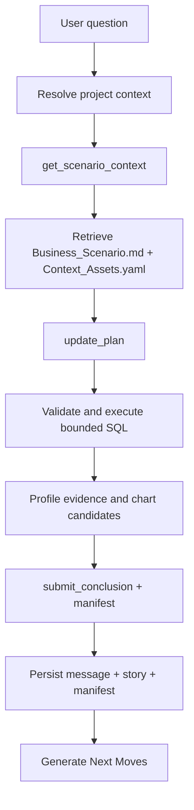

# v0.2 Business Analysis Design

## Purpose

v0.2 turns `databricks-builder-app-oai` from a general Databricks builder agent
into a more reliable business-question answering surface. The runtime migration
from v0.1 remains valid, but the next phase should not start from "how to build
an analyst agent." It should start from how the business asks analytical
questions and how senior human analysts answer them.

The product target is not "run SQL and summarize." A business answer must show
what metric or table definition was used, which filters and grain were applied,
what evidence supports the conclusion, what caveats remain, and which follow-up
actions are safe for the current role.

## Goals

- Persist project resource defaults from every settings surface that displays
  them.
- Persist structured `submit_conclusion` output as the durable assistant answer.
- Model the full business-analysis lifecycle from scenario to golden eval.
- Convert business requirements into reusable data assets, context assets, and
  analysis playbooks.
- Capture manual senior analyst execution as the source of truth for expected
  evidence and reasoning.
- Construct golden evals from manual analyst runs before optimizing agent
  orchestration.
- Add a machine-readable evidence manifest for each completed business answer
  once the analyst evidence contract is understood.
- Enforce parser-based read-only SQL classification and bounded query policy as
  part of trusted execution.
- Add semantic and context asset retrieval before SQL generation.
- Implement chart evidence where the human analyst process shows that visual
  shape matters.
- Benchmark agent orchestration against golden evals.
- Keep the existing OpenAI Agents SDK runtime boundary, SSE contract, and Story
  Canvas architecture unless an additive change is required.

## Non-Goals

- Replacing the OpenAI Agents SDK runtime from v0.1.
- Rebuilding the whole frontend.
- Normalizing all project settings into first-class tables in this phase.
- Granting access beyond Databricks workspace and Unity Catalog permissions.
- Shipping user-facing write actions in read-only/user-preview mode.
- Solving all dashboard/report authoring workflows.

## Lifecycle Model

The core v0.2 design object is the analysis lifecycle:


The lifecycle is still the analysis process, but v0.2 stores it in a compact
scenario bundle rather than one file per lifecycle step.

| Lifecycle step | Stored in | Why it matters |
|---|---|---|
| Business Scenario | `Business_Scenario.md` | Captures the business decision, audience, operating cadence, and what action the answer should support. |
| Business Analysis Requirement | `Business_Scenario.md` | Keeps the requirement type, question variants, answer contract, ambiguity policy, and actionability rules with the scenario narrative. |
| Data + Context Asset Preparation | `Context_Assets.yaml` | Names retrieval terms, metrics, glossary terms, tables, joins, ownership, freshness expectations, access constraints, and runtime binding. |
| Analysis Strategy / Method Selection | `Business_Scenario.md` | Stores method type, playbook step ids, evidence shapes, answer-shaping rules, and required/conditional steps. |
| Manual Senior Analyst Execution | Updates to `Business_Scenario.md`, `Context_Assets.yaml`, and `evals.yaml` | Feeds discovered assumptions, rejected paths, evidence shapes, and validation rules back into the compact bundle. |
| Golden Eval Construction | `evals.yaml` | Converts manual execution into expected source choices, SQL properties, evidence requirements, caveats, scoring anchors, and adversarial cases. |
| Agent Benchmark + Orchestration Design | Benchmark report and orchestration changes | Measures agent behavior against the golden case and only then changes tools, prompts, routing, or UI contracts. |

## Artifact Format and Source of Truth

v0.2 uses scenario-bundled artifacts. A scenario bundle is portable and
reviewable as a unit, with shared cross-scenario assets promoted later to a
top-level `_shared/` folder only when reuse is proven.

```text
scenario-bundle/
  User_Input.md
  README.md
  Business_Scenario.md
  Context_Assets.yaml
  evals.yaml
```

The source-of-truth rules are:

| Artifact kind | Format | Authoring rule |
|---|---|---|
| User input | Markdown | The only human-authored input. |
| Bundle README | Markdown | Generated bundle overview, status, and review notes. |
| Business scenario | Markdown | Canonical scenario, requirement, method, ambiguity, and answer-policy specification generated from `User_Input.md` and enriched by agents. |
| Context assets | YAML | Machine-checkable retrieval index, metric catalog, glossary, data profiles, joins, freshness expectations, and validation checks. |
| Golden evals | YAML | Machine-checkable expected behavior, scoring anchors, and adversarial cases. |

The business scenario owns descriptive prose and scenario-specific policy:
requirement type, method/playbook steps, ambiguity defaults, answer-shaping
rules, and rollout gating. `Context_Assets.yaml` owns reusable context and data
assets only. This keeps the bundle small and makes a future split into shared
metric or data assets straightforward.

Each generated artifact must include version, status, valid-from, supersedes,
generated-by, and last-reviewed-by metadata. This avoids silent breakage when a
metric definition, visit-base rule, or scenario interpretation changes.

## Bundle Generator Contract

The bundle generator is the upstream counterpart to `get_scenario_context`.
`get_scenario_context` retrieves scenario bundles at answer time; the bundle
generator creates and updates those bundles from business input, source context,
Databricks metadata, and analyst review. Without this contract, v0.2 artifacts
remain documentation instead of a repeatable preparation workflow.

The generator owns four responsibilities:

- Convert the single human-authored input into a complete scenario bundle.
- Enrich the bundle with source-code context and Databricks metadata when
  available.
- Ask targeted clarification questions when the business input is not complete
  enough to support decision-grade analysis.
- Regenerate only the affected generated sections when the user appends or
  edits the input.

The first implementation can be deterministic and file-based. It does not need
advanced retrieval or embeddings, but it must have a stable request/response
shape:

```typescript
interface BundleGeneratorRequest {
  bundleId: string;
  userInputText: string;
  existingArtifacts?: {
    readmeMarkdown?: string;
    businessScenarioMarkdown?: string;
    contextAssetsYaml?: string;
    evalsYaml?: string;
  };
  projectContext?: {
    projectId?: string;
    defaultCatalog?: string;
    defaultSchema?: string;
    warehouseId?: string;
    userRole?: string;
  };
  enrichmentMode: 'none' | 'source_only' | 'databricks_metadata' | 'databricks_profile';
  changedInputSections?: string[];
  reviewerInstructions?: string[];
}

interface BundleGeneratorResult {
  status:
    | 'complete'
    | 'partial_needs_clarification'
    | 'blocked_missing_business_input'
    | 'blocked_missing_data_context'
    | 'regenerated_with_assumptions'
    | 'validation_failed';
  bundleId: string;
  updatedArtifacts: Array<{
    role: 'readme' | 'business_scenario' | 'context_assets' | 'evals';
    content: string;
    changeType: 'created' | 'updated' | 'unchanged';
    reviewState: 'needs_review' | 'reviewed' | 'review_invalidated';
  }>;
  clarificationQuestions: string[];
  assumptions: string[];
  warnings: string[];
  blockedReasons: string[];
  validationResults: Array<{
    gate: string;
    status: 'pass' | 'warn' | 'fail';
    message: string;
  }>;
}
```

### Generator Inputs

The generator should treat each input category differently:

| Input | Role | Access rule |
|---|---|---|
| User input markdown | Business intent, scenario facts, decision context, and user-provided assumptions. | Required. This is the only human-authored seed. |
| Existing generated artifacts | Current bundle state and analyst-reviewed sections. | Optional. Preserve reviewed content unless contradicted by newer user input. |
| Source-code context | Existing app capabilities, project settings, runtime constraints, docs, and schema hints. | Read-only local inspection. Do not infer business facts from code alone. |
| Databricks metadata | Candidate tables, schemas, columns, freshness signals, row-count scale, lineage, and ownership. | Read-only enrichment. Use metadata and bounded profiling only. |
| Analyst feedback | Corrections, defaults, reviewed sections, or rejected assumptions. | Highest priority after direct user input. |

### Generated Outputs

The generator produces the complete compact bundle:

| Artifact | Generated responsibility |
|---|---|
| `README.md` | Bundle purpose, status, current generation state, review state, and what remains blocked. |
| `Business_Scenario.md` | Human-readable scenario specification, requirement narrative, method contract, playbook steps, ambiguity policy, answer-shaping rules, and completeness gate. |
| `Context_Assets.yaml` | Runtime-readable retrieval context, metric definitions, glossary, data profiles, joins, validation checks, and data-binding status. |
| `evals.yaml` | Stage-level golden eval skeleton, scoring anchors, adversarial cases, and benchmark expectations. |

The generator should not create an extra report file. The structured
`BundleGeneratorResult` is the run report, and concise generation status should
be written into the generated artifacts.

### Prompt Strategy

Generation should be staged. A single large prompt is too likely to hide
ambiguity, hallucinate data assets, or overwrite reviewed material.

1. Normalize the user input into scenario facts, open questions, and candidate
   requirement types.
2. Build a scenario fingerprint from decision owner, business decision,
   intervention, baseline, population, metrics, time windows, and actionability
   requirement.
3. Draft the locked business scenario markdown sections.
4. Run the completeness gate and classify missing information as blocking or
   non-blocking.
5. Add method contract, playbook steps, ambiguity policy, and answer-shaping
   rules to the scenario markdown.
6. Enrich candidate metrics, entities, joins, and validation checks from source
   context and Databricks metadata when allowed.
7. Generate `Context_Assets.yaml` from retrieval terms, reusable context
   assets, and data enrichment results.
8. Generate `evals.yaml` from the requirement type, playbook steps, ambiguity
   policy, answer rules, and expected evidence.
9. Validate markdown sections, YAML schemas, semantic consistency, stable ids,
   and review-state changes.

Each stage should receive the information it needs in the prompt payload. It
must not depend on another artifact being loaded later by filename. Runtime
artifacts may repeat compact facts when a consumer needs them independently.

### Locked Scenario Template

`Business_Scenario.md` must use a locked section template:

1. Artifact metadata.
2. Scenario name.
3. Business background.
4. Business goal.
5. Intervention.
6. Analysis population.
7. Core metrics.
8. Comparison design.
9. Success hypothesis.
10. Analysis contract and method.
11. Answer-shaping rules.
12. Ambiguity and default policy.
13. Required analysis views.
14. Validation requirements.
15. Key risks and caveats.
16. Scenario generation and completeness gate.

The generator must preserve this section order so reviewers, eval builders, and
future parsers can rely on stable headings.

### Databricks Enrichment Boundary

Databricks access during generation is enrichment, not analysis execution. The
generator may use read-only metadata operations to discover candidate assets:

- catalog, schema, table, view, and column names
- table comments, owners, tags, and lineage when available
- column types, nullable flags, and simple stats when available
- partition/date coverage and freshness metadata
- bounded row-count and null-rate profiling when explicitly enabled

The generator must not:

- write data, create objects, change permissions, or run DDL
- perform broad scans or expensive profiling by default
- extract sensitive row-level examples into generated docs
- treat an unconfirmed table name as a certified source
- make rollout conclusions before manual analysis execution

When Databricks context is unavailable, the generator should still create a
useful draft bundle with `asset_discovery_needed` or equivalent binding status.
It should record missing metadata as blocked data context, not invent physical
tables.

### Completeness and Clarification Gate

The completeness gate runs before downstream generation is marked complete:

- decision owner and decision are explicit
- intervention and baseline are explicit
- population, groups, and time windows are explicit
- metric names and business meanings are explicit
- analysis grains are explicit
- validation requirements are explicit
- ambiguities are surfaced with defaults or escalation rules

Blocking ambiguities should produce `partial_needs_clarification` or
`blocked_missing_business_input`. The generator should ask a small number of
targeted questions about decision-blocking facts, such as missing intervention,
baseline, population, time window, or success threshold.

Non-blocking ambiguities may use default assumptions only when the assumption is
explicitly recorded with caveats and an escalation rule. For example, a metric
definition may default to the preferred business interpretation while still
requiring analyst review before benchmark or rollout conclusions.

### Partial Regeneration

The generator must support append-and-regenerate workflows. When the user adds
new content to the input, the generator should:

- compute which scenario facts changed
- preserve analyst-reviewed sections unless the new input invalidates them
- regenerate only affected sections and dependent YAML fields
- mark reviewed sections as invalidated when their assumptions changed
- keep stable ids unless the underlying business object changed
- avoid timestamp-only churn when content is unchanged

Regeneration scope should follow dependency rules:

| Changed input | Regenerate |
|---|---|
| Decision owner, business decision, intervention, or baseline | Full scenario, context assets, and evals. |
| Metric definition, grain, population, or time window | Scenario metric/method sections, context metric catalog, and eval assertions. |
| Physical data-source hint | Context data profiles, joins, freshness checks, and execution eval properties. |
| New ambiguity, caveat, or answer rule | Scenario ambiguity policy, answer policy, validation checks, and answer-stage evals. |
| Reviewer correction | Affected generated sections plus review metadata. |

### Validation Gates

Generation is not complete until these gates pass or are explicitly marked as
blocked:

- `Business_Scenario.md` has the locked sections and no unresolved blocking
  ambiguity.
- `Context_Assets.yaml` parses and conforms to the expected top-level schema.
- `evals.yaml` parses and has anchored stage-level scoring dimensions.
- Scenario fingerprint, requirement type, metric names, grains, time windows,
  and caveat rules are semantically consistent across generated artifacts.
- Databricks-bound assets include binding status, confidence, owners or unknown
  owners, freshness expectations, and safe fallback behavior.
- A second generation run with unchanged input is idempotent except for
  explicitly requested metadata changes.

The generator can produce draft artifacts before all gates pass, but those
artifacts must carry a non-final status and clear blocked reasons.

## Seed Scenario

The first v0.2 lifecycle seed is the ML-based BDR routing optimization pilot.
The business scenario is:

```text
The BDR routing pilot is designed to evaluate whether a machine-learning-
generated routing and visit plan can outperform BDRs' traditional self-planned
routes. The pilot assigns ML-generated monthly visit plans to test-group BDRs
while comparable control-group BDRs continue normal planning. The business
objective is to determine whether the ML plan improves visit effectiveness,
frequency adherence, daily productivity, and travel efficiency enough to justify
BU or national rollout.

The analysis focuses on six core metrics: visit base coverage, visit frequency
adherence, visit time, travel / commute time, travel distance, and valid visits
per working day per BDR. The evaluation requires two complementary comparisons:
first, test-group BDR performance in the ML pilot month versus their own
previous non-ML month; second, test-group performance versus control-group
performance across both previous month and pilot month, including the
difference in month-over-month deltas.

The rollout decision should be based on whether the test group shows stronger
improvement than the control group, especially on coverage and frequency
adherence, while also reducing travel burden or increasing daily visit
productivity. Results must be validated at BDR, BDR-day, and BDR-POC-month
levels, with checks for visit-base correctness, valid visit definitions,
date-window alignment, join correctness, data freshness, outliers, and
control-group comparability.
```

The seed is intentionally more than a metric-diagnosis case. It is an
intervention evaluation and rollout decision. The agent must understand the
business goal, intervention, test/control population, comparison design, six
core metrics, analysis grains, validation requirements, and caveats before it
is allowed to produce rollout advice.

## Requirement Taxonomy

v0.2 should classify business questions before selecting data or tools. The
first taxonomy is:

| Type | Example question | Primary risk |
|---|---|---|
| Metric lookup | "What was sales last month?" | Wrong metric definition or filter. |
| Monitoring / variance | "Did coverage drop versus last month?" | Unclear baseline or incomplete period. |
| Diagnostic decomposition | "Why did coverage drop?" | Ranking change rates instead of contribution. |
| Segment discovery | "Where did it drop most?" | Sparse segments and hierarchy mismatch. |
| Driver analysis | "Was it fewer reps, fewer working days, productivity, or mix?" | Treating correlated drivers as causal. |
| Causal / experiment analysis | "Did the new routing plan improve visit efficiency?" | Overclaiming from observational data. |
| Forecasting | "What will happen next month?" | Missing uncertainty and baseline comparison. |
| Recommendation / optimization | "How should we reassign territories?" | Ignoring constraints and operational feasibility. |

The most important early requirement types are metric explanation, variance
diagnosis, root-cause decomposition, segment comparison, experiment / impact
evaluation, and operational recommendation. The BDR routing seed starts with
causal / experiment analysis plus operational recommendation because the
decision owner needs to decide whether to scale the ML route plan.

## Business Analysis Preparation Assets

The agent should retrieve explicit context before generating SQL. The minimum
asset library is:

| Asset | Purpose |
|---|---|
| Business glossary | Terms, synonyms, and business meanings. |
| Metric catalog | Definitions, owners, formulas, grains, filters, examples, and common mistakes. |
| Entity model | Customer/POC, employee/BDR, product, geography, and time definitions. |
| Join map | Approved joins, stable keys, expected cardinality, and unsafe joins. |
| Known pitfalls | Data quality issues, deprecated fields, edge cases, and mandatory filters. |
| Canonical SQL examples | Trusted patterns that can be parameterized and audited. |
| Validation checklist | Freshness, row counts, null rates, duplicates, join-cardinality, and reconciliation checks. |

Scenario playbook steps, ambiguity policy, answer templates, and answer-shaping
rules belong in `Business_Scenario.md` because they are scenario-specific
analysis policy rather than reusable data context. Golden eval cases belong in
`evals.yaml`.

Data assets should be grouped by analytical responsibility rather than just
catalog location:

- Core facts: visits, sales, orders, activity, inventory.
- Dimensions: POC/customer, employee/BDR, product/SKU, geography, calendar,
  channel.
- Bridges/maps: POC to WCCS ID, employee to territory, POC to BDR assignment,
  product to brand/category, region hierarchy.
- Semantic assets: metric views, certified dashboards, canonical SQL, metric
  definitions, dimensional hierarchies.
- Quality assets: freshness checks, row-count trends, null-rate profiles,
  duplicate-key checks, join-cardinality checks.

The first concrete fixtures live under:

- `User_Input.md`
- `Business_Scenario.md`
- `Context_Assets.yaml`
- `evals.yaml`

These fixtures are intentionally product-neutral. They describe the business
analysis operating system that analysts and business users need before an agent
can be benchmarked.

## Scenario Context Retrieval Contract

Artifacts become useful only when the runtime can retrieve them. Phase 3 should
prototype a deterministic retrieval stub before any full orchestration redesign:

```typescript
interface ScenarioContextRequest {
  question: string;
  projectId: string;
  userRole?: string;
  catalog?: string;
  schema?: string;
  conversationHints?: string[];
}

interface ScenarioContextResult {
  status: 'matched' | 'low_confidence' | 'no_match' | 'needs_clarification';
  confidence: number;
  scenarioBundle?: string;
  scenarioRef?: string;
  contextAssetsRef?: string;
  evalsRef?: string;
  matchedSignals: string[];
  missingInputs: string[];
  fallbackPolicy: 'use_matched_context' | 'ask_clarifying_question' | 'draft_new_scenario' | 'generic_safe_discovery';
}
```

Initial matching can be keyword and metadata based:

- scenario name and recurring questions
- requirement question variants
- metric names and glossary terms
- intervention/baseline terms
- asset and playbook ids

Fallback policy:

| Match status | Runtime behavior |
|---|---|
| `matched` | Retrieve `Business_Scenario.md`, `Context_Assets.yaml`, and `evals.yaml` before plan construction. |
| `low_confidence` | Ask a clarifying question or show the likely scenario with caveat before SQL. |
| `needs_clarification` | Ask targeted questions from the requirement ambiguity policy. |
| `no_match` | Use generic safe discovery only for low-risk metric lookup, or draft a new scenario from a new `User_Input.md` when the user is asking for decision support. |

The first implementation can expose this internally as
`get_scenario_context(question, project)` and use a simple file index over
scenario bundles. The output must be included in trace metadata and the answer
manifest.

## Stage-Level Golden Evals

Do not evaluate only final answers. The first eval suite should score six
stages:

| Stage | Question it answers | Typical scoring dimensions |
|---|---|---|
| Scoping | Did the agent understand the business requirement? | Metric, time window, population, ambiguity, no premature SQL. |
| Data/context discovery | Did it find the right assets? | Metric definition, fact table, dimensions, known pitfalls. |
| Planning | Did it choose a senior analyst strategy? | Business relevance, decomposition quality, validation plan, causal caution. |
| Execution | Did it produce correct SQL or code? | Metric, join, date boundary, grain, and read-only correctness. |
| Validation | Did it test trustworthiness? | Freshness, row counts, cardinality, sanity checks, data issue detection. |
| Answer writing | Did it write like a senior analyst? | Headline, quantified movement, drivers, caveats, confidence, next actions. |

This stage structure makes failures actionable. A bad final answer can be traced
to scoping, discovery, planning, execution, validation, or synthesis instead of
being treated as a generic model-quality issue.

## Build-Order Flywheel

v0.2 should build context assets through real cases, not as an abstract library:


The recommended build order is:

1. Pick three high-value scenarios.
2. Collect about twenty real business questions.
3. Classify requirement types.
4. Manually solve five representative cases.
5. Extract metric definitions, joins, pitfalls, and SQL patterns.
6. Create golden evals from manual execution results.
7. Build the first agent workflow around those evals.
8. Run the agent against the evals.
9. Improve context, tools, prompts, and orchestration from failure modes.
10. Expand scenario coverage.

The governing principle is: business analysis operating system first, agent
second, LLM last.

## Business Answer Contract

Every completed business answer should have two durable records:

1. A normal assistant message containing the user-visible answer.
2. A structured manifest linked to the execution/story.

```typescript
interface BusinessAnswerManifest {
  version: 1;
  question: string;
  answerSummary: string;
  status: 'complete' | 'partial' | 'error';
  sources: EvidenceSource[];
  metrics: MetricUse[];
  filters: AnswerFilter[];
  grain?: string;
  timeBounds?: { start?: string; end?: string; timezone?: string };
  rowBounds?: { rowsRead?: number; rowsReturned?: number; limitApplied?: number };
  freshness?: Array<{ source: string; observedAt?: string; caveat?: string }>;
  assumptions: string[];
  caveats: string[];
  confidence: 'high' | 'medium' | 'low';
  replay: {
    executionId?: string;
    storyId?: string;
    traceId?: string;
    queryIds?: string[];
  };
}

interface EvidenceSource {
  id: string;
  type: 'table' | 'metric_view' | 'query' | 'file' | 'tool';
  name: string;
  uri?: string;
  sql?: string;
  columns?: string[];
  rationale?: string;
}

interface MetricUse {
  name: string;
  definition?: string;
  source?: string;
  aggregation?: string;
}

interface AnswerFilter {
  field: string;
  op: string;
  value: string;
}
```

The manifest can start as JSON stored with execution/story metadata. It should
later be promoted into normalized tables if queryability becomes important.

## Agent Runtime Flow



The runtime flow is downstream of the lifecycle. The agent should not invent
the analyst process from scratch when a matching scenario policy, context/data
asset set, or golden eval exists.

### 1. Resolve Project and Lifecycle Context

The router already builds project context from project settings, conversation
overrides, resource defaults, release state, and run role. v0.2 adds lifecycle
context:

- User-preview runs should pin to the release snapshot when present.
- Effective resources must be included in trace metadata and the answer
  manifest.
- Missing catalog/schema/warehouse should become a visible setup warning before
  broad discovery runs.
- `get_scenario_context` should retrieve matching scenario bundles before plan
  construction, including the scenario policy and context/data assets.

### 2. Asset and Context Retrieval

Before broad SQL exploration, the runtime should narrow the data surface using
prepared assets:

- Rank candidate assets from preferred tables, metric views, sample queries,
  glossary terms, deprecated tables, project memory, and recent conversation.
- Prefer governed metric views and certified/preferred tables.
- Explain why an asset was chosen in the evidence manifest.
- Fall back to metadata discovery only when project context is insufficient.

Initial implementation can be deterministic heuristics plus prompt context. A
later implementation can add a schema/profile cache and embedding search.

### 3. Method-Driven Planning

The plan should reflect the selected analysis method. For example:

- Metric lookup: verify metric definition, apply required filters, return KPI
  and caveats.
- Trend: validate date grain, produce comparable periods, detect inflection.
- Segmentation: choose approved dimensions, rank segments, call out sparse
  groups.
- Root cause: compare candidate drivers and explicitly record rejected paths.
- Data quality: profile nulls, freshness, duplicates, and coverage before
  answering.

For modeled scenarios, each plan item should include `playbook_step_id` from
the scenario method contract. This makes playbook adherence deterministic in
evals instead of relying on subjective judge interpretation.

### 4. SQL Guardrails

`execute_sql` should enforce policy before hitting the warehouse:

- Parse SQL for statement type instead of checking string prefixes.
- Block writes, DDL, grants, external calls, and multi-statement mutation in
  read-only/user-preview mode.
- Require or inject a bounded `LIMIT` for exploratory queries.
- Validate catalog/schema resolution against effective resources.
- Optionally run `EXPLAIN` or a dry validation for complex queries.
- Capture query text, row bounds, warehouse, catalog/schema, and timing in the
  evidence manifest.

### 5. Evidence and Visualization

Tool results should become structured evidence, not only raw payloads:

- SQL rows/tables become table evidence with a source ID.
- Chartable SQL result sets receive a `ChartSpec` embedded in the evidence
  payload.
- Every chart must keep a table fallback.
- Source metadata and caveats should be visible in the inspector.

### 6. Synthesis and Persistence

`submit_conclusion` is the canonical final-answer tool. v0.2 should make it
durable:

- `synthesis.appended.summary` becomes the assistant message content when no
  normal text answer exists.
- Highlights and next steps are persisted with story/execution metadata.
- The manifest is persisted before `next_moves.updated` generation.
- Replay should reconstruct the story from durable messages, execution events,
  and manifest, not only from the latest in-memory stream.

### 7. Next Moves

The current Next Moves service should remain the backend generator. v0.2 changes
its input quality:

- Use persisted conclusion summary if `final_text` is empty.
- Include manifest summaries rather than raw tool payloads.
- Respect run role and release state.
- Add latency metadata and fallback reason to events.

## Frontend Impact

The Story Canvas remains the primary UI. v0.2 adds fields and renderers:

- Show answer confidence, assumptions, caveats, sources, and row/time bounds.
- Render chart evidence when `EvidenceBlock.chartSpec` is present.
- Let users toggle chart/table evidence.
- Link evidence blocks to SQL/source entries in the manifest.
- Keep raw payloads in the inspector, not the story body.

## Evaluation

Business-question eval cases should be source-controlled fixtures. Each case
should be built from manual senior analyst execution, not from idealized agent
outputs. Each case should include:

- business scenario
- user question
- `Context_Assets.yaml`
- method / playbook step ids
- manual execution evidence, once available
- expected source/table or metric choice
- expected SQL properties, not necessarily exact SQL text
- expected evidence requirements
- expected caveats or ambiguity handling
- latency/tool-call budget

Metrics:

- table/metric selection accuracy
- SQL safety classification
- SQL result sufficiency
- caveat/source completeness
- final answer usefulness
- playbook adherence
- rejected-path handling
- time to first plan
- time to first evidence
- total model/tool calls

## Efficiency Budgets

Budgets should be tiered by requirement type:

| Budget tier | Applies to | Target |
|---|---|
| `metric_lookup` | simple governed metric retrieval | <= 3 tool calls before first SQL; <= 20 seconds to first evidence. |
| `diagnostic` | variance, segmentation, root-cause | <= 4 tool calls before first SQL; 3-6 SQL queries after scoped plan. |
| `impact_evaluation` | pilots, experiments, rollout recommendation | <= 4 tool calls before first SQL; 5-10 SQL queries after scoped plan; <= 60 seconds to first evidence when warehouse is available. |
| `optimization` | territory or resource reassignment | requires explicit constraints and may exceed interactive budget. |

These are targets, not hard product promises. They should be measured in evals
and logs.

## Security and Governance

- Databricks permissions remain authoritative.
- Project settings narrow scope but do not grant platform access.
- Read-only/user-preview mode must receive read-oriented tools only.
- SQL safety must be enforced in code, not only in prompts.
- Model prompts and logs must not include Databricks tokens or model secrets.
- Release-pinned user sessions must not silently follow mutable draft settings.

## Open Questions

- Should the business-answer manifest be stored on `executions`, a new
  `stories` table, or both?
- When should scenario-bundle artifacts graduate from docs/project files into
  database-backed project assets?
- What confidence thresholds should `get_scenario_context` use for matched,
  low-confidence, needs-clarification, and no-match states?
- Which SQL parser should be used for Databricks SQL dialect coverage?
- What minimum synthetic dataset is sufficient for CI-repeatable BDR routing
  pilot evals?
