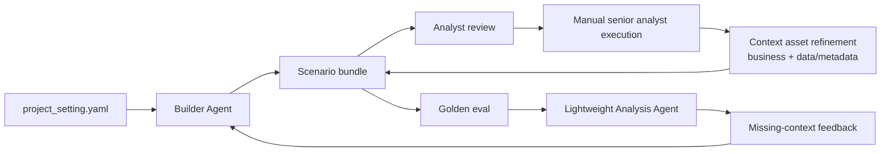
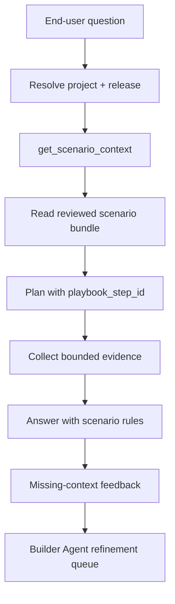

# v0.2 Builder Agent Scenario Bundle Design

## Purpose

v0.2 focuses on the Builder Agent as the preparation system for business
analysis. The Builder Agent accepts minimal, user-friendly input from
`project_setting.yaml`, collaborates with users, developers, analysts, source
code, and Databricks metadata, and generates a reviewed scenario bundle.

The scenario bundle is the product of v0.2. It contains business context, data
and metadata context, analysis principles, validation rules, manual analyst
traces, and golden evals. The Analysis Agent is a lightweight consumer of this
bundle. It may be used to validate and serve prepared scenarios, but it is not
the main build target for v0.2.

The product target is not "run SQL and summarize." It is to make the business
analysis preparation process explicit, reusable, testable, and governable
before end-user analysis is scaled.

## Goals

- Persist project resource defaults from every settings surface that displays
  them.
- Persist structured `submit_conclusion` output as the durable assistant answer.
- Define `project_setting.yaml` as the minimal user-authored payload source of truth:
  free-form business background, optional analysis notes, and selected
  Databricks resource hints.
- Implement the Builder Agent scenario-bundle generator and refinement loop.
- Generate and validate business context, data/metadata context, analysis
  principles, and golden eval artifacts.
- Capture manual senior analyst execution as the source of truth for expected
  evidence, reasoning, rejected paths, and caveats.
- Construct golden evals from manual analyst runs before optimizing any
  Analysis Agent consumer behavior.
- Define a lightweight Analysis Agent consumption contract so prepared bundles
  can be retrieved, tested, and served without mutating bundle rules.
- Add semantic and context asset retrieval as a bundle-consumption path, not as
  a generic workspace-discovery behavior.
- Keep the existing OpenAI Agents SDK runtime boundary, SSE contract, and Story
  Canvas architecture unless an additive change is required.

## Non-Goals

- Replacing the OpenAI Agents SDK runtime from v0.1.
- Rebuilding the whole frontend.
- Normalizing all project settings into first-class tables in this phase.
- Granting access beyond Databricks workspace and Unity Catalog permissions.
- Shipping user-facing write actions in read-only/user-preview mode.
- Solving all dashboard/report authoring workflows.
- Building a standalone production Analysis Agent before scenario bundles,
  manual traces, and golden evals are ready.
- Treating SQL execution, chart rendering, or answer manifests as the primary
  v0.2 deliverable.

## Builder Preparation Lifecycle

The core v0.2 design object is the Builder Agent preparation lifecycle:

```mermaid
flowchart LR
  Setting["project_setting.yaml"]
  Builder["Builder Agent"]
  Scenario["Business Context"]
  Context["Business + Data Context"]
  Strategy["Analysis Context"]
  Manual["Manual Senior Analyst Execution"]
  Golden["Golden Eval Construction"]
  Bundle["Reviewed Scenario Bundle"]
  Analysis["Lightweight Analysis Agent Consumer"]
  Feedback["Missing Context Feedback"]

  Setting --> Builder --> Scenario --> Context --> Strategy --> Manual --> Golden --> Bundle --> Analysis --> Feedback --> Builder
```



The lifecycle is the preparation process. v0.2 stores it in a compact scenario
bundle rather than one file per lifecycle step.

| Lifecycle step | Stored in | Why it matters |
|---|---|---|
| Project Setting | `project_setting.yaml` | Minimal user-authored payload source of truth for free-form business background, optional analysis notes, and selected Databricks resource hints. |
| Business Context | `business_context.yaml` | Captures the business decision, owner, population, metrics, comparison design, success hypothesis, risks, and actionability requirement. |
| Data + Metadata Context | `data_context.yaml` | Names retrieval terms, metric definitions, glossary terms, tables, joins, ownership, freshness expectations, access constraints, and runtime binding. |
| Analysis Context | `analysis_context.yaml` | Stores method type, playbook step ids, evidence shapes, ambiguity policy, answer-shaping rules, validation policy, manual-trace requirements, and canonical golden cases. |
| Manual Senior Analyst Execution | Updates to `business_context.yaml`, `data_context.yaml`, and `analysis_context.yaml` | Feeds discovered assumptions, rejected paths, evidence shapes, validation rules, and golden cases back into the compact bundle. |
| Golden Eval Construction | `analysis_context.yaml` and generated `evals.yaml` | Stores canonical golden cases in analysis context and projects them into eval fixtures when needed. |
| Analysis Agent Consumption | Retrieval and benchmark result | Uses reviewed bundles as read-only context and returns missing-context feedback for Builder Agent refinement. |

## Artifact Format and Source of Truth

v0.2 uses scenario-bundled artifacts. A scenario bundle is portable and
reviewable as a unit, with shared cross-scenario assets promoted later to a
top-level `_shared/` folder only when reuse is proven.

```text
scenario-bundle/
  project_setting.yaml
  README.md
  business_context.yaml
  data_context.yaml
  analysis_context.yaml
  evals.yaml
```

The source-of-truth rules are:

| Artifact kind | Format | Authoring rule |
|---|---|---|
| Project setting | YAML | Minimal user-authored payload source of truth. Covers free-form business background, optional analysis notes, and selected Databricks resource hints. |
| Bundle README | Markdown | Generated bundle overview, status, and review notes. |
| Business context | YAML | Structured scenario and decision context generated from `project_setting.yaml` and enriched by agents. |
| Data context | YAML | Machine-checkable retrieval index, metric catalog, glossary, data profiles, joins, freshness expectations, and validation checks. |
| Analysis context | YAML | Machine-checkable method contract, playbook, ambiguity policy, answer rules, validation policy, manual-trace requirements, and canonical golden cases. |
| Eval projection | YAML | Generated fixtures derived from canonical golden cases in `analysis_context.yaml`. |

`business_context.yaml` owns business facts and decision context.
`data_context.yaml` owns reusable data and metadata assets.
`analysis_context.yaml` owns analysis policy, principles, playbook steps, and
golden cases. This split keeps each artifact structured, independently
loadable, and straightforward to promote into shared assets later.

Each generated artifact must include version, status, valid-from, supersedes,
generated-by, and last-reviewed-by metadata. This avoids silent breakage when a
metric definition, visit-base rule, or scenario interpretation changes.

## Builder Agent and Analysis Agent Boundary

v0.2 separates preparation from serving.

The Builder Agent owns preparation. It works with developers, analysts, minimal
project settings, source code, Databricks metadata, and review feedback to
build and refine scenario bundles. Its outputs are business context, data and
metadata context, analysis principles, validation rules, and golden eval cases.
The Builder Agent may update bundle artifacts in draft mode, but reviewed
sections should be preserved unless project settings or analyst feedback
invalidate them.

The Analysis Agent owns read-only bundle consumption when serving or benchmark
runs are enabled. In v0.2, it is lightweight and can be treated as a component
inside the Builder Agent workflow. It retrieves a prepared scenario bundle,
follows its business context and analysis principles, uses its data/metadata
context to narrow discovery, and executes evidence collection and answer
writing for user questions. It should not mutate scenario bundles during an
end-user run. If it discovers missing context, it should return a gap or
feedback item for the Builder Agent workflow rather than silently rewriting the
bundle.

This boundary prevents two failure modes:

- treating preparation artifacts as passive docs that the runtime never uses
- letting end-user analysis runs rewrite the rules they are supposed to obey

## Bundle Generator Contract

The bundle generator is the upstream counterpart to `get_scenario_context`.
`get_scenario_context` retrieves scenario bundles at answer time; the bundle
generator is the first Builder Agent implementation surface. It creates and
updates scenario bundles from `project_setting.yaml`, source context,
Databricks metadata, and analyst review. Without this contract, v0.2 artifacts
remain documentation instead of a repeatable preparation workflow.

The generator owns four responsibilities:

- Convert the minimal project-setting payload source of truth into a complete scenario
  bundle.
- Enrich the bundle with source-code context and Databricks metadata when
  available.
- Ask targeted clarification questions when the project setting is not complete
  enough to support decision-grade analysis.
- Regenerate only the affected generated sections when the user edits the
  project setting.

The first implementation can be deterministic and file-based. It does not need
advanced retrieval or embeddings, but it must have a stable request/response
shape:

```typescript
interface BundleGeneratorRequest {
  bundleId: string;
  projectSettingYaml: string;
  existingArtifacts?: {
    readmeMarkdown?: string;
    businessContextYaml?: string;
    dataContextYaml?: string;
    analysisContextYaml?: string;
    evalsYaml?: string;
  };
  projectContext?: {
    projectId?: string;
    defaultCatalog?: string;
    defaultSchema?: string;
    warehouseId?: string;
    userRole?: string;
  };
  enrichmentMode: 'none' | 'source_only' | 'databricks_metadata' | 'databricks_profile';
  changedSettingPaths?: string[];
  reviewerInstructions?: string[];
}

interface BundleGeneratorResult {
  status:
    | 'complete'
    | 'partial_needs_clarification'
    | 'blocked_missing_project_setting'
    | 'blocked_missing_data_context'
    | 'regenerated_with_assumptions'
    | 'validation_failed';
  bundleId: string;
  updatedArtifacts: Array<{
    role: 'readme' | 'business_context' | 'data_context' | 'analysis_context' | 'evals';
    content: string;
    changeType: 'created' | 'updated' | 'unchanged';
    reviewState: 'needs_review' | 'reviewed' | 'review_invalidated';
  }>;
  clarificationQuestions: string[];
  assumptions: string[];
  warnings: string[];
  blockedReasons: string[];
  validationResults: Array<{
    gate: string;
    status: 'pass' | 'warn' | 'fail';
    message: string;
  }>;
}
```

### Generator Inputs

The generator should treat each input category differently:

| Input | Role | Access rule |
|---|---|---|
| `project_setting.yaml` | Natural-language business background, optional analysis notes, and user-selected Databricks resource hints. | Required. This is the only human-authored payload source of truth. |
| `AGENTS.md` | Optional project-local operating guide for reusable workflow, validation, escalation, and output rules. | Mechanism only. Load as a start-of-chat snapshot when present; do not use it as business payload, resource inventory, or a copy of `project_setting.yaml`. |
| Existing generated artifacts | Current bundle state and analyst-reviewed sections. | Optional. Preserve reviewed content unless contradicted by newer project settings. |
| Source-code context | Existing app capabilities, project settings, runtime constraints, docs, and schema hints. | Read-only local inspection. Do not infer business facts from code alone. |
| Databricks metadata | Candidate tables, schemas, columns, freshness signals, row-count scale, lineage, and ownership. | Read-only enrichment. Use metadata and bounded profiling only. |
| Analyst feedback | Corrections, defaults, reviewed sections, or rejected assumptions. | Highest priority after direct project settings. |

### Minimal Project Setting Schema

`project_setting.yaml` should be minimal and user-friendly. It should not mirror
the generated context artifacts or ask users to structure metrics, periods,
analysis units, answer rules, generated artifacts, or agent policy. The user
should provide two natural-language fields and select Databricks resources
where available. Builder Agent extraction turns this into structured business,
data, and analysis context.

```yaml
business_background: >-
  Natural-language scenario, objective, decision context, key questions, and
  expected outcome. This can be incomplete or informal.

analysis_notes:
  # Optional free-form notes, assumptions, known dates, caveats, or business
  # rules. These do not need to be complete or normalized.
  - string

databricks_resources:
  # Databricks workspace URL. Usually selected by the app or current profile.
  databricks_host: string | null

  # Optional compute hints. Use cluster_id for notebook/workflow execution and
  # warehouse_id for SQL. Leave null if the Builder Agent should infer or ask.
  cluster_id: string | null
  warehouse_id: string | null

  # Optional workspace source context. Use Databricks workspace paths.
  workspace_folders: string[]
  workspace_files: string[]
  workflows: string[]

  # Input schemas the Builder Agent may inspect.
  # Preferred format: <catalog.schema>.
  input_schemas: string[]

  # Input tables or views the Builder Agent may inspect.
  # Preferred format: <catalog.schema.table>.
  # If a legacy <schema.table> value is supplied, the Builder Agent must resolve
  # the missing catalog from workspace context or ask for clarification.
  input_tables: string[]

  # Governed metric views the Builder Agent may inspect.
  # Preferred format: <catalog.schema.metric_view>.
  input_metric_views: string[]

  # Input volume folders or files the Builder Agent may inspect.
  # Preferred format: /Volumes/<catalog>/<schema>/<volume>/<path_or_file>.
  input_volume_paths: string[]

  # Output schema for generated tables, views, or profiles.
  # Preferred format: <catalog.schema>. The Builder Agent may create the schema
  # if it does not exist and the user has permission.
  output_schema: string | null

  # Output folders on existing volumes for generated artifacts, profiles,
  # reports, or eval assets.
  # Preferred format: /Volumes/<catalog>/<schema>/<volume>/<folder>.
  # The Builder Agent may create missing folders under an existing volume when
  # the user has permission.
  output_volume_folders: string[]
```

Format handling rules:

- Treat all user-provided resources as hints until verified.
- Accept partial or legacy resource names only as draft hints; resolve them
  from selected workspace context or ask a clarification question.
- For `input_schemas`, inspect metadata inside the schema before selecting
  relevant tables.
- For `input_tables`, inspect schema, comments, ownership, freshness, and
  simple profiles before treating a table as trusted.
- For `input_volume_paths`, list only the selected folders or files.
- For `output_schema`, create the schema only when it is missing, the format is
  confirmed, and the user has permission.
- For `output_volume_folders`, create missing folders only under an existing
  volume and only when the user has permission.

### Project Operating Guide Contract

`AGENTS.md` should describe how the Builder Agent or Analysis Agent should work
for this project, not what the project facts are. It is useful for reusable
mechanism rules that do not belong in the scenario payload:

- workflow conventions and step ordering
- SQL validation standards and evidence requirements
- escalation rules for ambiguity or missing context
- output conventions that should persist across chats
- project-specific guardrails for when files or Databricks resources may be
  created or modified

It must not duplicate `project_setting.yaml`, generated bundle YAML, Databricks
resource inventories, one-off query findings, conversation summaries, or final
analysis results. The runtime may inject a bounded `AGENTS.md` snapshot at the
start of a chat. The agent should treat that snapshot as fixed for the chat and
should not re-read or adopt mid-chat edits unless the user explicitly asks.

Updating `project_setting.yaml` does not automatically copy payload into
`AGENTS.md`. Update `AGENTS.md` only when the user asks to change durable
agent behavior, or after confirming that a reusable operating rule should apply
to future chats.

### Generated Outputs

The generator produces the complete compact bundle:

| Artifact | Generated responsibility |
|---|---|
| `README.md` | Bundle purpose, status, current generation state, review state, and what remains blocked. |
| `business_context.yaml` | Structured business scenario, decision context, population, metrics, comparison design, required business views, caveats, and completeness gate. |
| `data_context.yaml` | Runtime-readable retrieval context, metric definitions, glossary, data profiles, joins, validation checks, and data-binding status. |
| `analysis_context.yaml` | Analysis principles, method contract, playbook steps, ambiguity policy, answer rules, validation policy, manual-trace requirements, and canonical golden cases. |
| `evals.yaml` | Generated eval projection from golden cases in `analysis_context.yaml`. |

The generator should not create an extra report file. The structured
`BundleGeneratorResult` is the run report, and concise generation status should
be written into the generated artifacts.

### Prompt Strategy

Generation should be staged. A single large prompt is too likely to hide
ambiguity, hallucinate data assets, or overwrite reviewed material.

1. Validate `project_setting.yaml` against the minimal project-setting schema.
2. Normalize minimal user input into resource hints, scenario facts, open
   questions, and candidate requirement types.
3. Load a bounded `AGENTS.md` snapshot only as operating guidance when it
   exists; do not use it to derive scenario facts or resource defaults.
4. Build a scenario fingerprint from decision owner, business decision,
   intervention, baseline, population, metrics, time windows, and actionability
   requirement.
5. Generate `business_context.yaml` from business facts and decision context.
6. Run the completeness gate and classify missing information as blocking or
   non-blocking.
7. Generate `analysis_context.yaml` with method contract, playbook steps,
   ambiguity policy, answer-shaping rules, validation policy, manual-trace
   requirements, and golden-case skeletons.
8. Enrich candidate metrics, entities, joins, and validation checks from source
   context and Databricks metadata when allowed.
9. Generate `data_context.yaml` from retrieval terms, reusable context
   assets, and data enrichment results.
10. Generate `evals.yaml` as a benchmark projection from
   `analysis_context.yaml` golden cases.
11. Validate YAML schemas, semantic consistency, stable ids, and review-state
    changes.

Each stage should receive the information it needs in the prompt payload. It
must not depend on another artifact being loaded later by filename. Runtime
artifacts may repeat compact facts when a consumer needs them independently.

### Structured Context Schemas

`business_context.yaml` must use stable top-level sections:

1. `metadata`
2. `scenario`
3. `background`
4. `goal`
5. `intervention`
6. `population`
7. `core_metrics`
8. `comparison_design`
9. `success_hypothesis`
10. `required_business_views`
11. `business_risks_and_caveats`
12. `completeness_gate`

`data_context.yaml` must use stable top-level sections:

1. `metadata`
2. `retrieval_index`
3. `metric_catalog`
4. `data_assets`
5. `approved_joins`
6. `validation_checks`

`analysis_context.yaml` must use stable top-level sections:

1. `metadata`
2. `feed_policy`
3. `requirement_classification`
4. `analysis_principles`
5. `method_contract`
6. `playbook_steps`
7. `answer_rules`
8. `ambiguity_policy`
9. `validation_policy`
10. `manual_trace_requirements`
11. `golden_cases`
12. `adversarial_cases`

The generator must preserve these sections so reviewers, eval builders, and
future parsers can rely on stable structured fields rather than markdown
headings.

### Databricks Enrichment Boundary

Databricks access during generation is enrichment, not analysis execution. The
generator may use read-only metadata operations to discover candidate assets:

- catalog, schema, table, view, and column names
- table comments, owners, tags, and lineage when available
- column types, nullable flags, and simple stats when available
- partition/date coverage and freshness metadata
- bounded row-count and null-rate profiling when explicitly enabled

The generator must not:

- write data, create objects, change permissions, or run DDL
- perform broad scans or expensive profiling by default
- extract sensitive row-level examples into generated docs
- treat an unconfirmed table name as a certified source
- make rollout conclusions before manual analysis execution

When Databricks context is unavailable, the generator should still create a
useful draft bundle with `asset_discovery_needed` or equivalent binding status.
It should record missing metadata as blocked data context, not invent physical
tables.

### Completeness and Clarification Gate

The completeness gate runs before downstream generation is marked complete:

- decision owner and decision are explicit
- intervention and baseline are explicit
- population, groups, and time windows are explicit
- metric names and business meanings are explicit
- analysis grains are explicit
- validation requirements are explicit
- ambiguities are surfaced with defaults or escalation rules

Blocking ambiguities should produce `partial_needs_clarification` or
`blocked_missing_business_input`. The generator should ask a small number of
targeted questions about decision-blocking facts, such as missing intervention,
baseline, population, time window, or success threshold.

Non-blocking ambiguities may use default assumptions only when the assumption is
explicitly recorded with caveats and an escalation rule. For example, a metric
definition may default to the preferred business interpretation while still
requiring analyst review before benchmark or rollout conclusions.

### Partial Regeneration

The generator must support update-and-regenerate workflows. When
`project_setting.yaml` changes, the generator should:

- compute which scenario facts changed
- preserve analyst-reviewed sections unless the new input invalidates them
- regenerate only affected sections and dependent YAML fields
- mark reviewed sections as invalidated when their assumptions changed
- keep stable ids unless the underlying business object changed
- avoid timestamp-only churn when content is unchanged

Regeneration scope should follow dependency rules:

| Changed project setting | Regenerate |
|---|---|
| Decision owner, business decision, intervention, or baseline | `business_context.yaml`, dependent `analysis_context.yaml`, and eval projection. |
| Metric definition, grain, population, or time window | Business metric fields, analysis method fields, data metric catalog, and golden-case assertions. |
| Physical data-source hint | `data_context.yaml` data profiles, joins, freshness checks, and execution eval properties. |
| Project resource default | Data binding, retrieval defaults, validation checks, and setup warnings. |
| New ambiguity, caveat, answer rule, or analysis principle | `analysis_context.yaml` policies, validation checks, golden cases, and answer-stage eval projection. |
| Reviewer correction | Affected generated sections plus review metadata. |

### Validation Gates

Generation is not complete until these gates pass or are explicitly marked as
blocked:

- `project_setting.yaml` parses and has the minimum project, settings, and
  business context fields needed for generation.
- `business_context.yaml`, `data_context.yaml`, and `analysis_context.yaml`
  parse and conform to their expected top-level schemas.
- `analysis_context.yaml` has canonical golden cases with anchored scoring
  dimensions where available.
- `evals.yaml` is generated from analysis-context golden cases and parses when
  eval fixtures are requested.
- Scenario fingerprint, requirement type, metric names, grains, time windows,
  and caveat rules are semantically consistent across generated artifacts.
- Databricks-bound assets include binding status, confidence, owners or unknown
  owners, freshness expectations, and safe fallback behavior.
- A second generation run with unchanged input is idempotent except for
  explicitly requested metadata changes.

The generator can produce draft artifacts before all gates pass, but those
artifacts must carry a non-final status and clear blocked reasons.

## Seed Scenario

The first v0.2 lifecycle seed is the ML-based BDR routing optimization pilot.
The business scenario is:

```text
The BDR routing pilot is designed to evaluate whether a machine-learning-
generated routing and visit plan can outperform BDRs' traditional self-planned
routes. The pilot assigns ML-generated monthly visit plans to test-group BDRs
while comparable control-group BDRs continue normal planning. The business
objective is to determine whether the ML plan improves visit effectiveness,
frequency adherence, daily productivity, and travel efficiency enough to justify
BU or national rollout.

The analysis focuses on six core metrics: visit base coverage, visit frequency
adherence, visit time, travel / commute time, travel distance, and valid visits
per working day per BDR. The evaluation requires two complementary comparisons:
first, test-group BDR performance in the ML pilot month versus their own
previous non-ML month; second, test-group performance versus control-group
performance across both previous month and pilot month, including the
difference in month-over-month deltas.

The rollout decision should be based on whether the test group shows stronger
improvement than the control group, especially on coverage and frequency
adherence, while also reducing travel burden or increasing daily visit
productivity. Results must be validated at BDR, BDR-day, and BDR-POC-month
levels, with checks for visit-base correctness, valid visit definitions,
date-window alignment, join correctness, data freshness, outliers, and
control-group comparability.
```

The seed is intentionally more than a metric-diagnosis case. It is an
intervention evaluation and rollout decision. The agent must understand the
business goal, intervention, test/control population, comparison design, six
core metrics, analysis grains, validation requirements, and caveats before it
is allowed to produce rollout advice.

## Requirement Taxonomy

v0.2 should classify business questions before selecting data or tools. The
first taxonomy is:

| Type | Example question | Primary risk |
|---|---|---|
| Metric lookup | "What was sales last month?" | Wrong metric definition or filter. |
| Monitoring / variance | "Did coverage drop versus last month?" | Unclear baseline or incomplete period. |
| Diagnostic decomposition | "Why did coverage drop?" | Ranking change rates instead of contribution. |
| Segment discovery | "Where did it drop most?" | Sparse segments and hierarchy mismatch. |
| Driver analysis | "Was it fewer reps, fewer working days, productivity, or mix?" | Treating correlated drivers as causal. |
| Causal / experiment analysis | "Did the new routing plan improve visit efficiency?" | Overclaiming from observational data. |
| Forecasting | "What will happen next month?" | Missing uncertainty and baseline comparison. |
| Recommendation / optimization | "How should we reassign territories?" | Ignoring constraints and operational feasibility. |

The most important early requirement types are metric explanation, variance
diagnosis, root-cause decomposition, segment comparison, experiment / impact
evaluation, and operational recommendation. The BDR routing seed starts with
causal / experiment analysis plus operational recommendation because the
decision owner needs to decide whether to scale the ML route plan.

## Business Analysis Preparation Assets

The agent should retrieve explicit context before generating SQL. The minimum
asset library is:

| Asset | Purpose |
|---|---|
| Business glossary | Terms, synonyms, and business meanings. |
| Metric catalog | Definitions, owners, formulas, grains, filters, examples, and common mistakes. |
| Entity model | Customer/POC, employee/BDR, product, geography, and time definitions. |
| Join map | Approved joins, stable keys, expected cardinality, and unsafe joins. |
| Known pitfalls | Data quality issues, deprecated fields, edge cases, and mandatory filters. |
| Canonical SQL examples | Trusted patterns that can be parameterized and audited. |
| Validation checklist | Freshness, row counts, null rates, duplicates, join-cardinality, and reconciliation checks. |

Scenario playbook steps, ambiguity policy, answer templates, answer-shaping
rules, and golden cases belong in `analysis_context.yaml` because they are
analysis policy rather than reusable data context. `evals.yaml` is generated
from those canonical golden cases when a test fixture is needed.

Data assets should be grouped by analytical responsibility rather than just
catalog location:

- Core facts: visits, sales, orders, activity, inventory.
- Dimensions: POC/customer, employee/BDR, product/SKU, geography, calendar,
  channel.
- Bridges/maps: POC to WCCS ID, employee to territory, POC to BDR assignment,
  product to brand/category, region hierarchy.
- Semantic assets: metric views, certified dashboards, canonical SQL, metric
  definitions, dimensional hierarchies.
- Quality assets: freshness checks, row-count trends, null-rate profiles,
  duplicate-key checks, join-cardinality checks.

The first concrete fixtures live under:

- `project_setting.yaml`
- `business_context.yaml`
- `data_context.yaml`
- `analysis_context.yaml`
- `evals.yaml`

These fixtures are intentionally product-neutral. They describe the business
analysis operating system that analysts and business users need before an agent
can be benchmarked.

## Scenario Bundle Retrieval Contract

Artifacts become useful only when a consumer can retrieve them. The lightweight
consumer validation phase should prototype a deterministic retrieval stub before
any broader serving redesign:

```typescript
interface ScenarioContextRequest {
  question: string;
  projectId: string;
  userRole?: string;
  catalog?: string;
  schema?: string;
  conversationHints?: string[];
}

interface ScenarioContextResult {
  status: 'matched' | 'low_confidence' | 'no_match' | 'needs_clarification';
  confidence: number;
  scenarioBundle?: string;
  businessContextRef?: string;
  dataContextRef?: string;
  analysisContextRef?: string;
  evalsRef?: string;
  matchedSignals: string[];
  missingInputs: string[];
  fallbackPolicy: 'use_matched_context' | 'ask_clarifying_question' | 'draft_new_scenario' | 'generic_safe_discovery';
}
```

Initial matching can be keyword and metadata based:

- scenario name and recurring questions
- requirement question variants
- metric names and glossary terms
- intervention/baseline terms
- asset and playbook ids

Fallback policy:

| Match status | Runtime behavior |
|---|---|
| `matched` | Retrieve `business_context.yaml`, `data_context.yaml`, and `analysis_context.yaml` before plan construction. |
| `low_confidence` | Ask a clarifying question or show the likely scenario with caveat before SQL. |
| `needs_clarification` | Ask targeted questions from the requirement ambiguity policy. |
| `no_match` | Use generic safe discovery only for low-risk metric lookup, or draft a new scenario from a new `project_setting.yaml` when the user is asking for decision support. |

The first implementation can expose this internally as
`get_scenario_context(question, project)` and use a simple file index over
scenario bundles. The output must be included in trace metadata and missing
context feedback.

## Stage-Level Golden Evals

Do not evaluate only final answers. The first eval suite should score six
stages:

| Stage | Question it answers | Typical scoring dimensions |
|---|---|---|
| Scoping | Did the agent understand the business requirement? | Metric, time window, population, ambiguity, no premature SQL. |
| Data/context discovery | Did it find the right assets? | Metric definition, fact table, dimensions, known pitfalls. |
| Planning | Did it choose a senior analyst strategy? | Business relevance, decomposition quality, validation plan, causal caution. |
| Execution | Did it produce correct SQL or code? | Metric, join, date boundary, grain, and read-only correctness. |
| Validation | Did it test trustworthiness? | Freshness, row counts, cardinality, sanity checks, data issue detection. |
| Answer writing | Did it write like a senior analyst? | Headline, quantified movement, drivers, caveats, confidence, next actions. |

This stage structure makes failures actionable. A bad final answer can be traced
to scoping, discovery, planning, execution, validation, or synthesis instead of
being treated as a generic model-quality issue.

## Build-Order Flywheel

v0.2 should build scenario bundles through real cases, not as an abstract
semantic-layer exercise. Each pass starts with minimal project settings and
uses the Builder Agent to refine both business context inputs and data/metadata
context:

- Business context: scenario facts, decision owner, decision frequency,
  metric priorities, rollout thresholds, and caveats.
- Data/metadata context: metric catalog, tables, fields, joins, freshness,
  lineage, profiles, ownership, known pitfalls, and canonical query patterns.
- Analysis context: requirement type, analysis principles, ambiguity defaults,
  answer rules, validation gates, manual trace requirements, and golden cases.

This improves correctness by reducing wrong-scope, wrong-metric, wrong-grain,
and unsafe-causality answers. It improves efficiency by narrowing discovery,
reducing broad metadata scans, and cutting SQL retry loops.



The recommended build order is:

1. Pick one high-value scenario and capture minimal `project_setting.yaml`.
2. Implement a file-based Builder Agent generator that creates the six-file
   scenario bundle.
3. Run the completeness gate and clarification loop until the bundle is a
   usable draft.
4. Enrich context with bounded source-code and Databricks metadata.
5. Review the generated business, data, and analysis contexts with a senior
   analyst.
6. Manually solve representative cases and record evidence shapes, rejected
   paths, caveats, and discovered context gaps.
7. Regenerate affected bundle sections from analyst corrections and metadata
   findings.
8. Create and calibrate golden evals from the manual execution results.
9. Run the lightweight Analysis Agent only as a consumer smoke test and
   benchmark harness for reviewed bundles.
10. Feed consumer failures back into the Builder Agent refinement queue.
11. Expand scenario coverage after the seed bundle can be generated, reviewed,
   evaluated, and consumed end to end.

The governing principle is: Builder Agent first, scenario bundle as product,
Analysis Agent as bundle consumer.

## Analysis Agent Consumption Contract

The Analysis Agent is a lightweight consumer of reviewed scenario bundles. It
can be a component inside the Builder Agent workflow for benchmark and serving
validation, but it should not be treated as an independent v0.2 product.



The consumption contract is intentionally narrow:

- Read reviewed bundle artifacts as immutable context.
- Use `business_context.yaml` for business intent, population, metric
  priorities, comparison design, and caveats.
- Use `data_context.yaml` for metric, glossary, table, join, freshness, and
  validation context.
- Use `analysis_context.yaml` on every run for method, analysis principles,
  ambiguity policy, answer-shaping rules, and validation policy.
- Retrieve golden cases from `analysis_context.yaml` on demand for benchmark,
  example, or eval behavior.
- Emit missing-context feedback when the bundle is incomplete, instead of
  rewriting scenario rules during an end-user run.

The Builder Agent may use this lightweight Analysis Agent in three ways:

- smoke-test a bundle against golden cases
- identify missing business or data context from failed analysis attempts
- validate that a reviewed bundle is ready for end-user serving

SQL guardrails, chart evidence, answer manifests, and end-user UI polish remain
important for later serving phases, but they are downstream of the v0.2 Builder
Agent deliverable.

## Evaluation

v0.2 evals should primarily score the Builder Agent. The key question is not
"can an end-user agent answer this question yet?" The key question is "can the
Builder Agent turn minimal project settings into a reviewed, runnable,
decision-grade scenario bundle?"

Builder Agent eval cases should include:

- input `project_setting.yaml`
- existing artifacts when testing update or partial regeneration behavior
- optional source-code and Databricks metadata fixtures
- reviewer feedback or appended project-setting changes
- expected artifact status, blocked reasons, assumptions, and warnings
- expected generated sections and YAML fields
- expected clarification questions for blocking gaps
- expected review-state preservation or invalidation behavior
- expected golden eval coverage and scoring anchors

Builder Agent metrics:

- project-setting schema validity
- scenario completeness and business-policy extraction
- context asset schema validity and metadata-enrichment precision
- ambiguity detection and default/escalation quality
- artifact consistency across `business_context.yaml`, `data_context.yaml`,
  `analysis_context.yaml`, and generated `evals.yaml`
- idempotency on unchanged inputs
- partial-regeneration accuracy on changed inputs
- preservation of reviewed content
- missing-context detection
- human-review readiness
- golden-eval coverage and anchor quality

The lightweight Analysis Agent should be evaluated only after the bundle passes
Builder Agent gates. Its first eval role is consumer validation:

- retrieve the reviewed bundle
- follow the scenario method and answer rules
- use context assets without broad rediscovery
- avoid mutating bundle artifacts
- emit missing-context feedback when the bundle is insufficient

## Efficiency Budgets

Builder Agent budgets should be tied to generation stage, not only to end-user
question type:

| Budget tier | Applies to | Target |
|---|---|
| `schema_validation` | parse and validate `project_setting.yaml` and generated YAML | deterministic local checks, no model call. |
| `file_only_generation` | create or update the six-file bundle from project settings and existing artifacts | small number of staged model calls; no Databricks calls. |
| `metadata_enrichment` | discover candidate tables, columns, owners, freshness, and joins | bounded metadata calls over declared catalogs/schemas/tables; no broad scans by default. |
| `partial_regeneration` | update affected sections after project-setting or reviewer changes | unchanged files remain unchanged; reviewed sections preserved unless invalidated. |
| `consumer_smoke_test` | lightweight Analysis Agent run against reviewed bundle | scoped retrieval and bounded evidence collection; missing context returns to Builder Agent. |

These are targets, not hard product promises. They should be measured in
generator logs, eval reports, and lightweight consumer traces.

## Security and Governance

- Databricks permissions remain authoritative.
- Project settings narrow scope but do not grant platform access.
- The Builder Agent may update draft bundle artifacts only within the project
  workspace and review workflow.
- The Analysis Agent treats reviewed scenario bundles as read-only context.
- Read-only/user-preview mode must receive read-oriented tools only.
- SQL safety must be enforced in code, not only in prompts.
- Model prompts and logs must not include Databricks tokens or model secrets.
- Release-pinned user sessions must not silently follow mutable draft settings.

## Open Questions

- What review workflow should mark generated bundle artifacts as reviewed,
  rejected, or invalidated?
- When should scenario-bundle artifacts graduate from docs/project files into
  database-backed project assets?
- What confidence thresholds should `get_scenario_context` use for matched,
  low-confidence, needs-clarification, and no-match states?
- Which Databricks metadata fixtures are sufficient for repeatable Builder
  Agent enrichment tests?
- What minimum synthetic dataset is sufficient for CI-repeatable BDR routing
  pilot evals?
- How should missing-context feedback from lightweight Analysis Agent runs be
  queued, reviewed, and merged back into scenario bundles?
