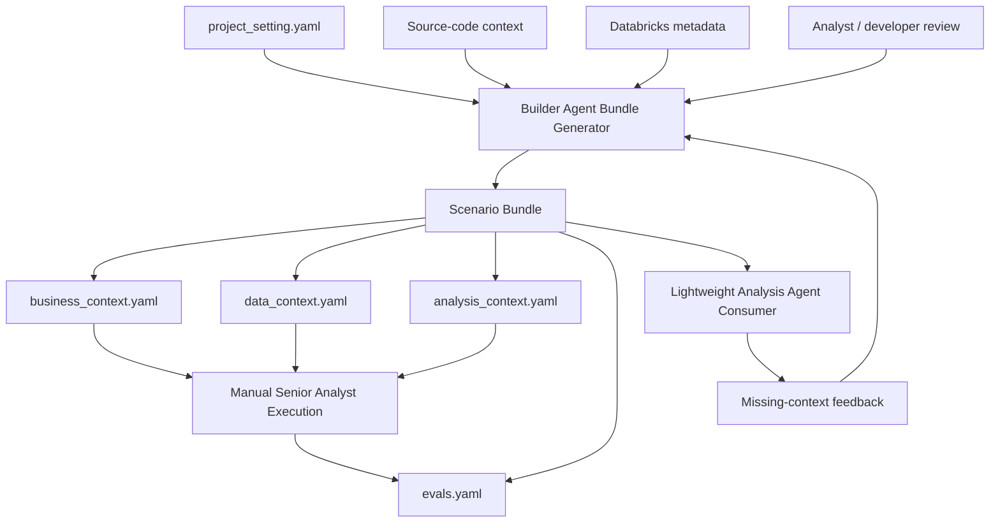

# v0.2 Builder Agent Gap Analysis

Date: 2026-05-09

Scope: local source and docs under `databricks-builder-app-oai/` and
`docs/builder-app-oai/`. This review does not include live AI Gateway,
Databricks workspace, browser, or load testing.

## Builder Agent Target

For v0.2, the app should reliably turn minimal user-friendly project input into
a reviewed scenario bundle that can later support business-question answering.

The expected path is:

1. Accept `project_setting.yaml` as the user-authored payload source of truth.
2. Generate the scenario bundle with the Builder Agent.
3. Enrich the bundle with business context, source-code context, and Databricks
   data/metadata context.
4. Run completeness checks and clarification loops before claiming readiness.
5. Review and manually execute representative cases with a senior analyst.
6. Convert manual execution into golden evals.
7. Let a lightweight Analysis Agent consume reviewed bundles as read-only
   context and return missing-context feedback.

The OAI app has the runtime foundation for this, but it is still closer to a
general Databricks builder/coding agent than a repeatable scenario-bundle
preparation system.

## Refactored Lifecycle Gap

The next gap is not primarily an answer-runtime gap. The larger gap is that the
product does not yet implement the preparation lifecycle that creates the
business, data, and evaluation assets an Analysis Agent should depend on:

```text
Project Setting
-> Builder Agent Bundle Generation
-> Business Context Preparation
-> Data and Metadata Context Preparation
-> Analysis Principles and Validation Policy
-> Manual Senior Analyst Execution
-> Golden Eval Construction
-> Lightweight Analysis Agent Consumption
-> Missing-Context Feedback
```

Without this lifecycle, the team can over-optimize prompts, SQL safety,
visualization, or answer wording before it has a reviewed and runnable bundle
that defines what correct analysis means.

The first seed scenario is the ML-based BDR routing pilot. It covers a Sales
Ops / Regional Sales Director / BU leadership decision on whether an
ML-generated monthly routing and visit plan outperforms traditional BDR
self-planning enough to justify BU or national rollout.

The first draft bundle artifacts are:

- `project_setting.yaml`
- `README.md`
- `business_context.yaml`
- `data_context.yaml`
- `analysis_context.yaml`
- `evals.yaml`

These are intentionally draft artifacts. They make the missing work concrete:
implement the Builder Agent generator that creates and updates them, confirm
source-specific data definitions with humans, run the senior analyst case
manually, convert the trace into calibrated evals, and then smoke-test
read-only consumption.

## Documentation Strategy

`docs/builder-app-oai/` is the documentation root for the OAI app. Root feature
docs should stay aligned with source code and product goals.

Versioned folders track phase progress:

- `v0.1-agents-sdk-integration/`: historical runtime migration from Claude SDK
  to OpenAI Agents SDK.
- `v0.2-business-analysis/`: current gap-filling phase for Builder Agent
  scenario-bundle preparation.

The v0.1 docs should remain as migration history with small errata. They should
not become the Builder Agent or business-answering roadmap.

## High-Level Architecture



What is strong in the current foundation:

- Runtime boundary is clear: routers and storage use a runtime-neutral facade.
- Tool allowlisting happens by construction through the OpenAI tool list.
- Databricks tool auth and model credentials are separate.
- Plan and synthesis events are structured tool events, not markdown parsing.
- Project context can include resources, semantics, release state, policy, and
  user-preview role.
- Phase 1 fixed the persistence gap for project resources and structured
  conclusion fallback text.
- `project_setting.yaml` now has an OAI app implementation surface: a
  Pydantic schema, readable YAML renderer/parser, default file creation,
  get/save/parse/validate API routes, Project Management import/save/validate
  UI, and save-time sync back into persisted project resource defaults.

What is still missing is the Builder Agent layer that converts project settings
and metadata into a reviewed scenario bundle.

## Comparison Against Current Docs

| Document set | Current state | Gap to track |
|---|---|---|
| v0.1 runtime migration docs | Explain the OpenAI Agents SDK migration and implemented runtime boundaries. | Keep as migration history; do not use them as the v0.2 preparation roadmap. |
| Planning and orchestration docs | Correctly define plan and conclusion tools as the story contract. | Add acceptance gates only after bundle-generated evidence contracts are known. |
| Data visualization docs | Define chart evidence design. | Treat chart evidence as downstream serving work after the seed bundle and evals are runnable. |
| Project Management docs | Define durable settings, resources, semantics, releases, roles, memory, and governance. | `project_setting.yaml` should stay much smaller: free-form business background, optional notes, and selected Databricks resource hints. `AGENTS.md` should carry only reusable operating guidance. Builder Agent output should carry the structured project and analysis context. |
| Next Moves docs | Backend Next Moves service exists with model and heuristic generation. | Quality depends on future evidence and bundle context, not on more generic prompt polish. |
| Frontend refactor docs | Story canvas and inspector direction match source. | v0.2 correctness depends more on Builder Agent artifacts than more frontend refactoring. |

## Resolved in Phase 1

- Project Management resource defaults are now included in the panel save
  payload for catalog, schema, cluster, warehouse, workspace folder, and MLflow
  experiment.
- Structured `submit_conclusion` summaries now provide fallback durable answer
  text for assistant-message persistence and Next Moves when normal streamed
  assistant text is empty.
- `AGENTS.md` is no longer a resource-ledger payload source or a hard
  Databricks-tool gate. It is a project operating guide loaded as a bounded
  start-of-chat snapshot when useful.

## Correctness Gaps

| Priority | Gap | Why it matters |
|---|---|---|
| P0 | The Builder Agent bundle generator is documented but not implemented. | This is the gate that turns minimal project settings into the scenario, context, and eval assets needed for reliable business analysis. |
| P0 | The bundle generator is not wired to `project_setting.yaml` validation results, changed-path tracking, or artifact generation. | The app can parse, save, validate, and sync project settings, but the preparation lifecycle still cannot turn those inputs into reviewed bundle artifacts safely. |
| P0 | The completeness and clarification loop is not implemented. | Missing intervention, baseline, population, time window, metric meaning, or success threshold should produce targeted questions rather than confident-looking generated artifacts. |
| P0 | Review-state preservation and partial regeneration are not implemented. | Analyst-reviewed sections can drift or be overwritten when the user edits a small project-setting field. |
| P0 | Source-code and Databricks metadata enrichment are not implemented as bounded read-only Builder Agent steps. | `data_context.yaml` can remain generic or speculative instead of being bound to real candidate assets, owners, fields, freshness, and joins. |
| P0 | The compact bundle is draft-only. The ML-based BDR routing seed has generated-style artifacts, but no completed manual analyst execution. | Agent quality cannot be judged reliably until the human analytical process is captured and converted into calibrated evals. |
| P0 | Golden evals are not calibrated against manual execution or generator behavior. | Final-answer-only or uncalibrated scoring cannot isolate failures in generation, scoping, discovery, planning, execution, validation, or synthesis. |
| P0 | No real or synthetic Databricks dataset is bound to the seed context assets. | Manual execution and CI-repeatable evals are blocked until the data contract is runnable. |
| P0 | The Builder Agent and Analysis Agent boundary is not implemented in runtime behavior. | Builder runs should mutate draft bundles; Analysis Agent runs should consume reviewed bundles as read-only context and return missing-context feedback. |
| P0 | No deterministic scenario-bundle retrieval path is implemented for consumer runs. | Even excellent artifacts can be ignored unless the runtime can retrieve them before planning. |
| P1 | Requirement taxonomy is documented but not implemented in generator or eval code. | The Builder Agent needs deterministic classification to select method, answer policy, eval structure, and context requirements. |
| P1 | Context assets are not yet operational. | Metric definitions, data profiles, join maps, pitfalls, canonical SQL, and validation checklists are fixtures rather than validated runtime assets. |
| P1 | SQL correctness guardrails remain mostly prompt/tool conventions. | This matters for later Analysis Agent serving, but it should be prioritized after bundle generation and evals define required evidence. |
| P1 | Read-only SQL enforcement is prefix-based and treats any query starting with `WITH` as read-only. | User-preview/read-only mode can allow unsafe CTE patterns unless SQL is parsed and classified. |
| P1 | Generated FastMCP schemas are broad and schema fidelity is a known risk. | Bad tool arguments can cause failed calls, accidental defaults, and retry churn. |
| P2 | Chart evidence is designed but not implemented. | Trend, ranking, composition, and anomaly questions remain harder to inspect, but chart work should follow evidence contracts from manual analysis. |
| P2 | Skill guidance injects root `SKILL.md` only. | Specialized Databricks guidance can be truncated to summaries. |
| P2 | Several progress snapshots overstate product readiness. | "Complete" sometimes means schema/UI exists, not end-to-end bundle generation, review, eval, and consumption are verified. |

## Efficiency Gaps

| Priority | Gap | Efficiency impact |
|---|---|---|
| P0 | No partial-regeneration engine. | Small project-setting edits can force full artifact regeneration, increase review burden, and introduce drift. |
| P0 | No metadata-enrichment boundary or cache. | Builder runs may either avoid useful metadata or fall into repeated broad discovery. |
| P1 | No scenario-bundle retrieval index. | Consumer runs may rediscover context from scratch instead of using reviewed bundles. |
| P1 | Tool surface can be very large when all skills are enabled. | More tool schemas increase prompt/tool-selection overhead and make broad lifecycle tools easier to select accidentally. |
| P1 | Plan-driven execution has fixed turn cost. | Simple consumer smoke tests can pay create/start/finish/conclusion tool-call overhead before useful evidence. |
| P2 | Execution events are stored as a growing JSON array in one row. | Long runs become increasingly expensive to append, replay, and query. |
| P2 | Next Moves add a post-run model call by default. | Tail latency and cost increase, and incomplete evidence context weakens relevance. |
| P2 | Builder and consumer budget telemetry is not measured. | Correctness scaffolding can make common workflows too slow if generation and consumption budgets are not tracked separately. |

## Fit Against Builder-Agent Goal

| Requirement | Current state | Gap |
|---|---|---|
| Capture minimal project settings | `project_setting.yaml` exists for the seed scenario and is backed by the OAI app's `ProjectSetting` / `DatabricksResources` schema, API routes, Project Management import/save/validate UI, default-file creation, and save-time sync into project settings. | Needs changed-path tracking, bundle-generator consumption, artifact schema validation, and review policy. |
| Generate scenario bundle | Draft artifacts exist. | No implemented Builder Agent create/update generator, staged prompts, validation gates, or idempotency checks. |
| Prepare business context | `business_context.yaml` contains structured scenario and decision context. | Needs generator enforcement, completeness checks, reviewer state, and partial regeneration. |
| Prepare data/metadata context | `data_context.yaml` contains drafted metric and data context. | Needs bounded source-code and Databricks metadata enrichment, binding confidence, owners, freshness, and runnable validation queries. |
| Prepare analysis context | `analysis_context.yaml` contains analysis principles, method contract, playbook, policies, and canonical golden cases. | Needs manual-trace calibration, reviewer confirmation, and consumer feed validation. |
| Capture manual analyst execution | Manual execution is planned. | Needs real or synthetic data and a completed trace with evidence shapes, rejected paths, caveats, and context gaps. |
| Construct golden evals | Golden cases now belong in `analysis_context.yaml`; `evals.yaml` is a generated projection. | Needs Builder Agent generation evals, anchored scoring, manual-trace calibration, adversarial cases, and validation tests. |
| Validate bundle consumption | Runtime foundation exists. | Needs deterministic bundle retrieval, read-only consumption behavior, and missing-context feedback routing. |

## Recommended v0.2 Priorities

1. Treat v0.2 as the Builder Agent phase: project setting to reviewed scenario
   bundle.
2. Extend the existing `project_setting.yaml` schema/API/UI workflow with
   changed-path detection, artifact schema validation, review metadata, and
   bundle-generator consumption of validation results.
3. Implement the Builder Agent bundle generator create/update contract,
   staged prompt strategy, completeness gate, clarification loop, review-state
   preservation, and partial regeneration.
4. Add bounded source-code and Databricks metadata enrichment for
   `data_context.yaml`.
5. Run the generator on the BDR routing pilot project setting and preserve
   draft status until blocking business or data-context gaps are resolved.
6. Bind the BDR context assets to a real Databricks catalog/schema or create a
   synthetic dataset so manual execution and CI-repeatable evals are possible.
7. Complete `analysis_context.yaml` with analysis principles, playbook steps,
   ambiguity policy, validation policy, and canonical golden cases.
8. Complete the manual senior analyst execution and record evidence shapes,
   SQL, validation, rejected paths, caveats, and context gaps.
9. Calibrate Builder Agent generation evals and business-analysis stage evals
   from manual execution results.
10. Prototype deterministic scenario-bundle retrieval so reviewed bundles are
   reachable by the lightweight Analysis Agent consumer.
11. Run consumer smoke tests and route missing-context feedback back into
   Builder Agent refinement.
12. Defer broader Analysis Agent orchestration, SQL parser hardening, chart
   evidence, durable answer manifests, and UI polish until eval failures show
   they are the next bottleneck.
13. Expand from the seed scenario into a scenario-to-eval matrix after the
   first bundle is generated, reviewed, evaluated, and consumed end to end.

## Validation Still Needed

- Changed-path detection and bundle-generator consumption of
  `project_setting.yaml` validation results.
- Builder Agent generator validation for create runs, update runs,
  clarification status, blocked status, partial regeneration, review-state
  invalidation, idempotency, and artifact consistency.
- Scenario bundle validation for `business_context.yaml`,
  `data_context.yaml`, `analysis_context.yaml`, and generated `evals.yaml`.
- Read-only bounded source-code and Databricks metadata enrichment validation.
- Real or synthetic data binding for the BDR routing pilot context assets.
- Senior analyst review of ML routing pilot metric definitions, test/control
  scope, visit-base denominator, join keys, exclusions, rollout thresholds, and
  required caveats.
- Manual execution validation for SQL, intermediate evidence shape, rejected
  paths, caveats, and context gaps.
- Builder Agent generation evals for schema handling, scenario completeness,
  context enrichment, ambiguity handling, artifact consistency, idempotency,
  and partial regeneration.
- Stage-level business-analysis evals for scoping, discovery, planning,
  execution, validation, and answer writing.
- Scenario-bundle retrieval validation for lightweight Analysis Agent consumer
  runs.
- Read-only consumer validation: reviewed bundles are not mutated, missing
  context is returned as feedback, and bundle method rules are followed.
- Later serving validation for SQL parser safety, chart evidence, evidence
  manifests, browser replay, and live Databricks warehouse smoke tests.
