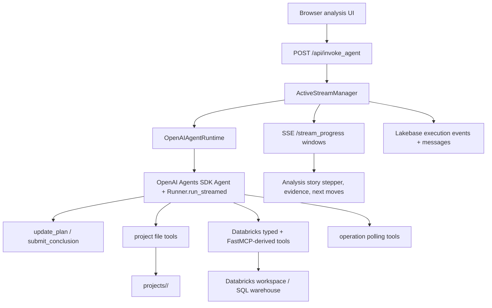

# v0.2 Business Analysis Gap Analysis

Date: 2026-05-07

Scope: local source and docs under `databricks-builder-app-oai/` and
`docs/builder-app-oai/`. This review does not include live AI Gateway,
Databricks workspace, browser, or load testing.

## Business-Question Target

For business-question answering, the app should reliably turn a user question
into:

1. The right business context: metric definitions, table choices, filters,
   grain, caveats, permissions, and release/user role.
2. Efficient evidence collection: bounded SQL and metadata inspection against
   the correct warehouse, catalog, schema, and preferred tables.
3. A defensible answer: plan, evidence, assumptions, caveats, source links, and
   next moves that survive refresh/replay.
4. A usable analyst surface: structured progress, evidence drilldown, visual
   summaries where useful, and no raw tool noise in the primary story.

The OAI app has the foundation for this, but it is still closer to a general
Databricks builder/coding agent than a high-confidence business analyst.

## Documentation Strategy

`docs/builder-app-oai/` is the documentation root for the OAI app. The root
feature docs should stay aligned with source code and product goals.

Versioned folders track phase progress:

- `v0.1-agents-sdk-integration/`: historical runtime migration from Claude SDK
  to OpenAI Agents SDK.
- `v0.2-business-analysis/`: current gap-filling phase for reliable business
  question answering.

The v0.1 docs should remain as migration history with small errata and links to
v0.2. They should not become the business-answering roadmap.

## High-Level Architecture

What is strong:

- Runtime boundary is clear: routers and storage use a runtime-neutral facade.
- Tool allowlisting happens by construction through the OpenAI tool list.
- Databricks tool auth and model credentials are separate.
- Plan and synthesis events are structured tool events, not markdown parsing.
- Project context can include resources, semantics, release state, policy, and
  user-preview role.

## Comparison Against Current Docs

| Document set | Current state | Gap to track |
|---|---|---|
| `v0.1-agents-sdk-integration/*` | Explains runtime migration and most implemented runtime boundaries. | Keep as v0.1 history; update only stale paths, package-manager policy, and links to v0.2. |
| `planning-orchestration.md` | Correctly defines `update_plan` and `submit_conclusion` as the story contract. | Add v0.2 acceptance gates for persisting and replaying structured conclusions. |
| `data-visualization.md` | Defines `ChartSpec` and phased chart evidence design. | No current implementation path produces chart evidence. |
| `project-management/*` | Defines durable settings, resources, semantics, releases, roles, memory, and governance. | Remaining v0.2 work is business-answer behavior on top of project settings, not the resource save path. |
| `next-moves/*` | Backend Next Moves service exists with model and heuristic generation. | Quality now depends on richer evidence context and future manifest summaries. |
| `frontend-refactor/*` | Story canvas, story card, and inspector direction matches source. | Business-answer correctness now depends more on backend evidence contracts than more frontend refactoring. |

## Resolved in Phase 1

- Project Management resource defaults are now included in the panel save
  payload for catalog, schema, cluster, warehouse, workspace folder, and MLflow
  experiment.
- Structured `submit_conclusion` summaries now provide fallback durable answer
  text for assistant-message persistence and Next Moves when normal streamed
  assistant text is empty.

## Correctness Gaps

| Priority | Gap | Why it matters |
|---|---|---|
| P1 | The semantic layer is too thin. Preferred tables, glossary, sample queries, and caveats are prompt text, not a queryable semantic retrieval path. | The model can choose the wrong table, grain, metric definition, or filters when several similar assets exist. |
| P1 | SQL correctness guardrails are mostly prompt/tool conventions. There is no mandatory query plan, schema-grounding step, SQL parse/lint gate, source manifest, row-limit policy, or evidence sufficiency check before synthesis. | The agent may produce plausible conclusions from partial, unsafe, or inefficient evidence. |
| P1 | Read-only SQL enforcement is prefix-based and treats any query starting with `WITH` as read-only. | User-preview/read-only mode can allow unsafe CTE patterns unless SQL is parsed and classified. |
| P1 | Generated FastMCP schemas are used broadly even though schema fidelity is a known risk. `_normalize_schema` is shallow and malformed JSON args can become `{}`. | Bad arguments can cause failed calls, accidental defaults, and retry churn. |
| P1 | Chart evidence is designed but not implemented. `EvidenceType` includes `chart`, but there is no chart spec, detection, or renderer path. | Trend, ranking, composition, and anomaly questions remain harder to inspect and easier to misread. |
| P2 | Skill guidance injects root `SKILL.md` only. Referenced skill files are visible in the Skills Explorer but not agent-browsable at runtime. | Specialized Databricks guidance can be truncated to summaries. |
| P2 | Project custom skill precedence can overwrite project-local skill content during sync. | Project-specific business rules should be the hardest rules to lose. |
| P2 | Direct OpenAI fallback in docs diverges from runtime expectations where agent runs require `OPENAI_BASE_URL`. | Setup and debugging become less predictable. |
| P2 | Several progress snapshots overstate product readiness. | "Complete" sometimes means schema/UI exists, not end-to-end business-answer behavior is verified. |
| P2 | There is no single business-answer definition of done across docs. | Cross-cutting failures fall between planning, project, visualization, and next-moves docs. |

## Efficiency Gaps

| Priority | Gap | Efficiency impact |
|---|---|---|
| P1 | Tool surface can be very large when all skills are enabled. | More tool schemas increase prompt/tool-selection overhead and make broad lifecycle tools easier to select accidentally. |
| P1 | Plan-driven execution has fixed turn cost. | Simple questions pay create/start/finish/conclusion tool-call overhead before useful SQL. |
| P1 | Long-running generated tools use in-memory operation state and per-call executors. | Concurrent slow Databricks calls create thread pressure and lose continuity across process restart. |
| P2 | Execution events are stored as a growing JSON array in one row. | Long runs become increasingly expensive to append, replay, and query. |
| P2 | Next Moves add a post-run model call by default. | Tail latency and cost increase, and incomplete `final_text` weakens relevance. |
| P2 | No latency/tool-call budgets are defined for business answers. | Correctness scaffolding can make common analyst questions too slow. |

## Fit Against Business-Question Goal

| Requirement | Current state | Gap |
|---|---|---|
| Find relevant data | Project settings can list preferred tables and defaults; tools can inspect catalogs/schemas/tables. | No semantic index, schema profile cache, metric registry, or table-ranking flow. |
| Ask efficient SQL | `execute_sql` uses default catalog/schema/warehouse and timeout. | No enforced limits, freshness checks, explain/cost gate, or query template selection. |
| Use governed metrics | Project settings support metric views. | No first-class metric-view answering path in the analyst loop. |
| Explain evidence | Tool results become evidence blocks and inspect-panel payloads. | No required source manifest in the conclusion. |
| Visualize analytical shape | Visualization design exists and type includes `chart`. | No implementation produces chart evidence today. |
| Persist and replay answers | Execution events and messages are persisted after completion; structured synthesis now backs assistant text when normal text is empty. | A durable business-answer manifest is still missing. |
| Support user preview | Release-pinned settings and read-only mode exist. | SQL prefix safety still weakens reliability. |
| Prove quality | Runtime and helper unit tests exist. | No business-question eval suite scores table choice, SQL correctness, evidence, caveats, usefulness, or latency. |

## Recommended v0.2 Priorities

1. Add a business-answer evidence manifest and replay contract.
2. Replace prefix SQL safety checks with parser-based classification and
   bounded query policy.
3. Build the semantic answering lane: candidate asset ranking, metric-view
   helpers, schema/profile cache, and glossary-aware resolution.
4. Add offline business-question evals with quality and latency criteria.
5. Implement chart evidence for SQL results.
6. Narrow tools per run and move long operation state to durable storage.

## Validation Still Needed

- SQL safety tests for CTE plus write statements.
- Schema-fidelity tests for generated FastMCP tools.
- Browser tests for plan events, synthesis cards, evidence replay,
  cancellation, and reload.
- Live smoke tests with AI Gateway and a safe Databricks SQL warehouse.
- Business-question evals for table choice, SQL correctness, evidence
  sufficiency, caveat handling, answer usefulness, and latency.
