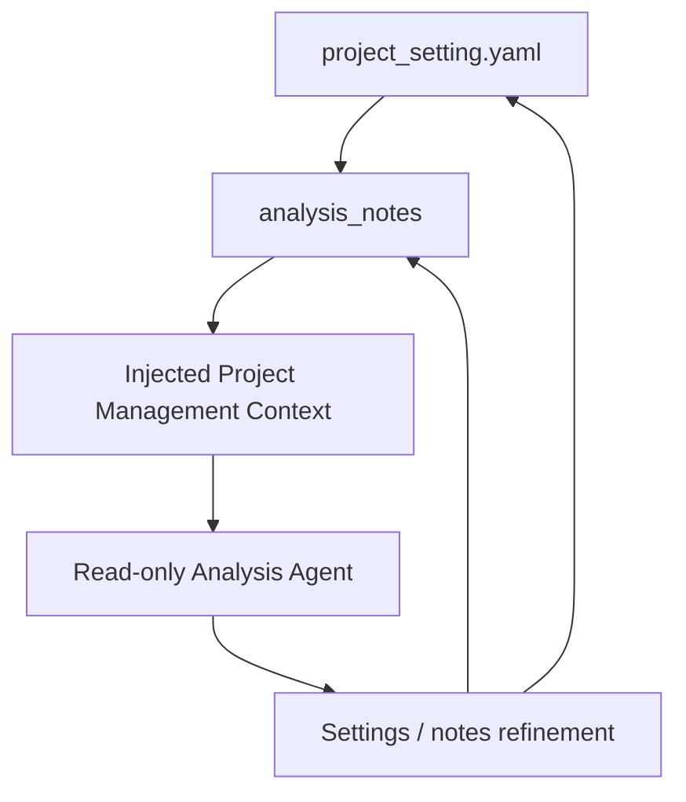

# BDR Routing Pilot Reference Assets

This folder is the seed reference set for the v0.2 analyst pilot.

## Source of Truth

Only `project_setting.yaml` is active runtime payload for v0.2. It is minimal
input: free-form business background, analysis notes, and Databricks resource
hints that users can select from the UI.

The other files are reference scaffolding from the original bundle-generator
direction. Keep them because they are useful for future v0.4 manual trace and
golden-case work, but do not treat them as required runtime inputs for the
v0.2 pilot:

- `business_context.yaml`: reference business context.
- `data_context.yaml`: reference data and metadata context.
- `analysis_context.yaml`: reference analysis policy and initial golden-case
  ideas for v0.4.
- `evals.yaml`: generated-style eval projection retained as v0.4 reference
  material.

## Workflow Visualization

The v0.2 pilot workflow is Project Settings + Analysis Notes first. A
lightweight read-only Analysis Agent consumes the injected project context and
returns feedback that can become durable notes or settings updates.



## Pilot Asset Order

1. `project_setting.yaml`
2. `analysis_notes` inside `project_setting.yaml`
3. read-only pilot run
4. settings / notes refinement
5. optional reference YAML updates for v0.4

Read-only pilot feedback should update analysis notes first when the agent or
analyst discovers missing context, rejected paths, validation rules, or
caveats. Reference YAML files can still be updated when they help preserve
future v0.4 trace or golden-case ideas.

## Folder Convention

Reference asset folder ids use:

```text
scenario-<three digit sequence>-<short slug>
```

Runtime ids inside artifacts use snake_case, for example
`ml_based_bdr_routing_pilot`. The folder id is stable for review and
portability; runtime ids are stable for evals and traces.
