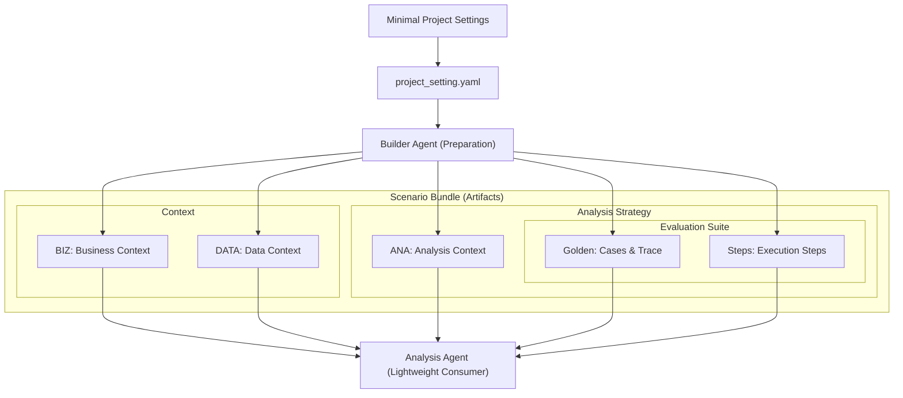

# Scenario Bundle: ML-Based BDR Routing Pilot

This folder is the canonical seed bundle for v0.2 Builder Agent preparation.

## Source of Truth

Only `project_setting.yaml` is human-authored source of truth. It is minimal
input: free-form business background, optional analysis notes, and Databricks
resource hints that users can select from the UI. All other files are generated
or regenerated by agents from:

- `project_setting.yaml`
- repository source code
- Databricks data and metadata
- analyst review notes

Generated bundle context is structured YAML:

- `business_context.yaml`
- `data_context.yaml`
- `analysis_context.yaml`
- `evals.yaml`

`evals.yaml` is a generated eval projection. Canonical golden cases live in
`analysis_context.yaml` so the Analysis Agent can retrieve them on demand and
the eval runner can project them into test fixtures.

## Workflow Visualization

The scenario bundle is prepared by a Builder Agent and consumed by a lightweight
Analysis Agent component. The Builder Agent works with developers, analysts,
source context, and available Databricks metadata to create and refine the
bundle. The Analysis Agent only leverages the reviewed bundle as read-only
context for smoke tests, benchmarks, and later end-user serving.



## Generation Order

1. `project_setting.yaml`
2. `business_context.yaml`
3. `data_context.yaml`
4. `analysis_context.yaml`
5. `evals.yaml`

Manual analyst execution can update `business_context.yaml`,
`data_context.yaml`, and `analysis_context.yaml` when the analyst discovers
missing context, rejected paths, validation rules, or golden cases. `evals.yaml`
is regenerated from the golden cases when eval fixtures are needed.

## Folder Convention

Scenario bundle ids use:

```text
scenario-<three digit sequence>-<short slug>
```

Runtime ids inside artifacts use snake_case, for example
`ml_based_bdr_routing_pilot`. The bundle id is stable for folder-level review
and portability; runtime ids are stable for retrieval, evals, and traces.
