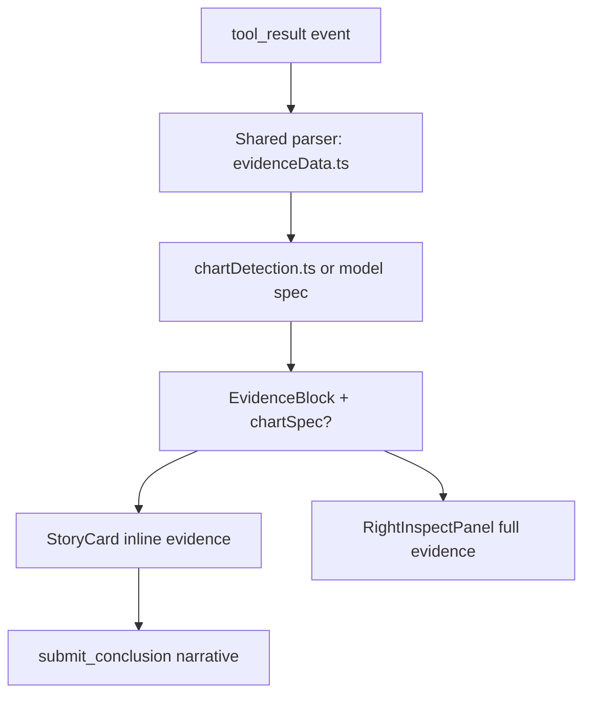

# v0.3 Visual Storytelling Design

## Product Intent

v0.3 is successful when an analyst or decision owner can read an analysis story
and decide what to do next without opening a separate BI tool.

This release is not about dashboard parity. It is about persuasive, auditable,
in-conversation analysis narratives.

## Audience And Reading Behavior

| Audience | Reads for | Time budget | Needs from story |
|---|---|---|---|
| Analyst | Validity and drill-down | 2-5 minutes | Full evidence access and caveats |
| Team manager | Decision direction | < 60 seconds | Clear claim + strongest evidence + action |
| Decision owner | Risk and next commitment | < 90 seconds | Confidence and caveats before action |

Design implication:

- The story card must be readable as a standalone narrative.
- The inspect panel remains detail and audit surface.

## Narrative Contract

Each completed analysis story should contain:

1. `DecisionClaim`: one sentence answer to the user question.
2. `PrimaryEvidence`: one chart or table that best supports the claim.
3. `Insight`: one-line interpretation of what the evidence means.
4. `CaveatAndConfidence`: limitations plus confidence level.
5. `RecommendedNextStep`: concrete follow-up action.

Suggested structure extension:

```typescript
interface StoryNarrative {
  claim: string;
  primaryEvidenceId?: string;
  insight?: string;
  caveat?: string;
  confidence?: 'high' | 'medium' | 'low';
  recommendedNextStep?: string;
}
```

This can be introduced incrementally as optional metadata.

## Story Card Reading Order

Target read flow:

```text
Question
-> Claim
-> Primary evidence (chart/table)
-> Insight annotation
-> Caveat + confidence
-> Recommended next step
-> Optional additional evidence
```

UI principle:

- Evidence must appear before final recommendation.
- Primary evidence should be visually distinct from secondary evidence.

## Narrative Voice And Confidence Policy

Use confidence-calibrated wording:

- High confidence: "Data shows..."
- Medium confidence: "Evidence suggests..."
- Low confidence: "Preliminary signal indicates..."

Required behavior:

- If confidence is medium/low, caveat is mandatory.
- If evidence is contradictory, confidence cannot be high.

## Canonical Story Scenarios

These scenarios define expected narrative quality, not only chart selection.

| Scenario | Question shape | Primary evidence | Required caveat | Recommended next step |
|---|---|---|---|---|
| Trend deterioration | "How has conversion changed over time?" | Line chart over time | Recent period incompleteness | Investigate top 2 drop periods |
| Segment outlier | "Which segment underperformed?" | Ranked bar chart | Sample size for small segments | Drill into bottom segment drivers |
| Mix shift | "What changed in channel mix?" | Stacked area/bar | Attribution assumptions | Rebalance spend across top channels |
| Correlation suspicion | "Is response time linked to churn?" | Scatter plot | Correlation is not causation | Run controlled cohort analysis |

## Architecture And Data Flow



Rule:

- One parser for both table rendering and chart detection.

## Data Contract

Add chart metadata to evidence:

```typescript
export interface ChartSpec {
  chartType: 'bar' | 'line' | 'area' | 'pie' | 'scatter' | 'heatmap';
  xField: string;
  yFields: string[];
  colorField?: string;
  sizeField?: string;
  xLabel?: string;
  yLabel?: string;
  sort?: 'asc' | 'desc' | 'natural';
  stacked?: boolean;
  showLabels?: boolean;
  title?: string;
  insight?: string;
}

export interface EvidenceBlock {
  id: string;
  type: EvidenceType;
  title: string;
  content: string;
  rawContent?: string;
  isError?: boolean;
  createdAt: string;
  toolName?: string;
  toolInput?: string;
  chartSpec?: ChartSpec;
}
```

Compatibility:

- `chartSpec` is optional.
- Existing persisted stories replay safely without migration.

## Phase 1 Design: Heuristic Visuals

Goal:

- Convert chartable SQL evidence into inline visuals with table fallback.

Key rules:

- Detect charts only for read-oriented SQL result tables.
- Do not chart metadata, schema listings, or single-value outputs.
- If spec invalid or render fails, fallback to table silently.

Narrative outcome in Phase 1:

- Story includes visible evidence in the card, not just inspect panel.
- Analyst can see claim-supporting data shape quickly.

## Phase 2 Design: Model-Guided Narrative Visuals

Goal:

- Improve chart choice and insight quality using question context.

Preferred contract:

- Extend `submit_conclusion` with optional `visualizations`.
- Emit structured visualization spec event.
- Attach spec to evidence by id when available.

Fallback contract:

- Parse `__chart_spec__` blocks from conclusion text only if needed.

Narrative outcome in Phase 2:

- Evidence is paired with explicit insight annotation and better chart intent.

## Phase 3 Design: `visualize_data` And Continuation

Goal:

- Make visualization intent explicit in tool planning.

Tool concept:

```python
visualize_data(
  sql_query: str,
  chart_type: str = "auto",
  x_field: str | None = None,
  y_fields: list[str] | None = None,
  color_field: str | None = None,
  title: str | None = None,
  insight: str | None = None,
  warehouse_id: str | None = None,
) -> str
```

Requirements:

- Reuse read-only SQL safety gates from `execute_sql`.
- Return rows/columns + `chart_spec`.
- Mark output as visualization payload for transforms.

Chart-driven continuation:

- Clicking chart marks proposes a drill-down prompt.
- Prompt is user-confirmed, not auto-sent.

Narrative outcome in Phase 3:

- Stories become interactive paths, not static outputs.

## Contradiction Handling

When conclusion and evidence disagree:

1. Flag mismatch in story state.
2. Downgrade confidence to medium/low.
3. Require caveat line in conclusion.
4. Suggest a validation next step.

This preserves trust and keeps the story auditable.

## Export And Share Model

Minimum v0.3 shareability:

1. Copy story as Markdown:
   - question
   - claim
   - insight
   - caveat/confidence
   - recommended next step
2. Export chart PNG for primary evidence.

Full story image export can be deferred if it risks release stability.

## Non-Goals

- Dashboard composition and saved chart workspace
- Advanced chart editing
- Auto-sent chart interactions
- Server-side chart image rendering
- Statistical proof engine for every insight claim
