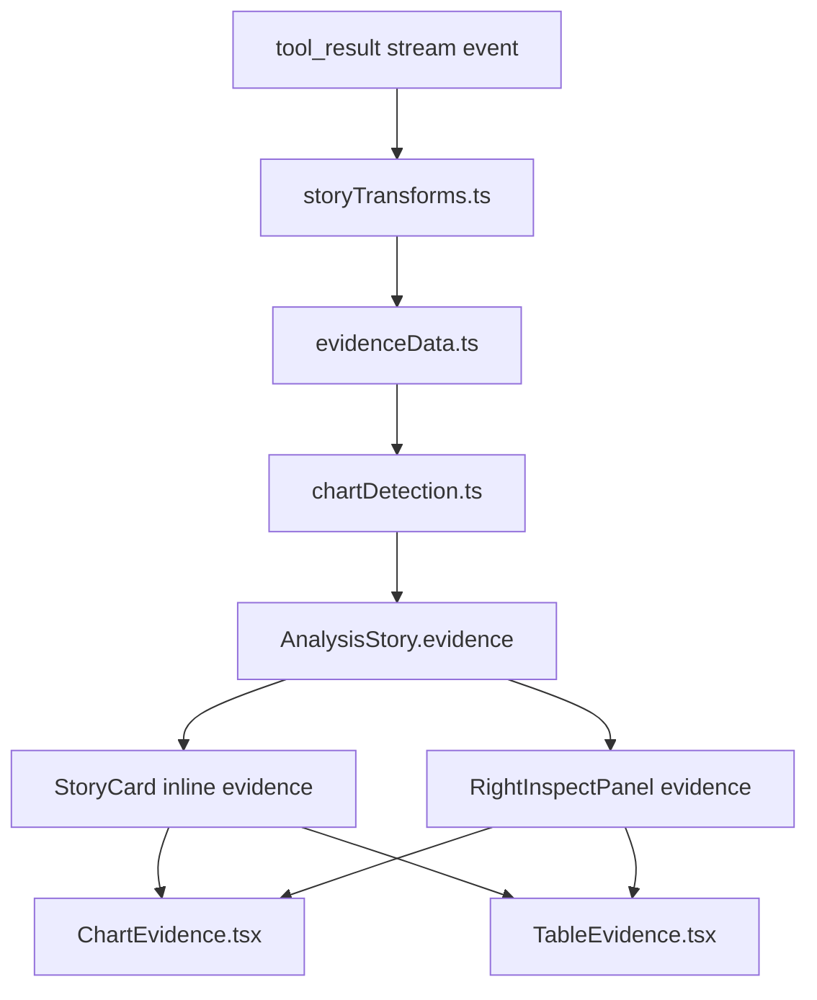

# v0.3 Visual Storytelling Design

## Purpose

v0.3 turns Analysis Stories from text-plus-inspector records into readable
visual narratives. A chart is not a dashboard widget in this release. It is
evidence inside the story, paired with the underlying data and tied to the
conclusion the analyst is evaluating.

The current OAI app already has a plan, evidence, conclusion, and next-move
model. This design keeps that shape and adds visualization as an additive
evidence capability.

## Goals

- Render important SQL evidence inline in the main Analysis Story Panel.
- Auto-detect simple charts from existing SQL results with no backend changes
  in Phase 1.
- Preserve the current right inspect panel as the detailed evidence/debug view.
- Let every chart switch back to its underlying table.
- Keep persisted executions backward compatible.
- Let later phases add model-guided chart specs and chart-driven next moves
  without replacing the Phase 1 path.

## Non-Goals

- Dashboard authoring or a saved chart library.
- AI/BI dashboard parity.
- Arbitrary chart editing controls.
- Server-side image generation for charts.
- Statistical validation of every insight annotation in v0.3.
- Auto-running a new agent request when a user clicks a chart point.

## User Experience

The story card becomes the primary reading surface:

```text
Question
Plan / worked steps
Evidence strip
  - chart evidence when chartable
  - table evidence when not chartable
  - errors and schema inspection remain compact
Conclusion
Next Moves
```

Evidence still appears in the right inspect panel with raw tool input and full
details. The main story card shows the narrative version: titles, charts,
compact tables, and the data toggle needed to trust the visual.

## Architecture



The core rule is that chart and table rendering share the same parsed data.
There should not be one parser for tables and another for charts.

## Data Contract

Add a chart spec to the analysis types:

```typescript
export interface ChartSpec {
  chartType: 'bar' | 'line' | 'area' | 'pie' | 'scatter' | 'heatmap';
  xField: string;
  yFields: string[];
  colorField?: string;
  sizeField?: string;
  xLabel?: string;
  yLabel?: string;
  sort?: 'asc' | 'desc' | 'natural';
  stacked?: boolean;
  showLabels?: boolean;
  title?: string;
  insight?: string;
}

export interface EvidenceBlock {
  id: string;
  type: EvidenceType;
  title: string;
  content: string;
  rawContent?: string;
  isError?: boolean;
  createdAt: string;
  toolName?: string;
  toolInput?: string;
  chartSpec?: ChartSpec;
}
```

`chartSpec` is optional. Existing persisted events remain valid because old
evidence blocks simply do not have a chart spec.

## Shared Evidence Data Utilities

Move the private parsing logic currently embedded in `EvidenceContent.tsx` into
a reusable module:

```text
client/src/features/analysis/evidenceData.ts
```

Responsibilities:

- `tryParseJson(text)`.
- `asRowTable(value)` returning `{rows, columns}` or `null`.
- `cellToString(value)`.
- `rowsToCsv(columns, rows)`.
- `safeFilename(name)`.
- Optional helpers for numeric/date column inference.

`EvidenceContent`, `ChartEvidence`, and chart detection must all use this
module. This avoids cases where the table view accepts a payload but chart
detection silently cannot read it.

## Phase 1: Client-Side Chart Detection

Phase 1 is frontend-only.

`storyTransforms.ts` handles a successful SQL `tool_result` like this:

```text
rawContent = event.content
tabular = asRowTable(JSON.parse(rawContent))
chartSpec = detectChartSpec(toolName, tabular)
evidence.type = chartSpec ? 'chart' : 'tool_result'
evidence.chartSpec = chartSpec
```

Detection runs only when:

- the tool is `execute_sql` or `execute_sql_multi`
- the result is row-oriented tabular data
- there are at least two rows
- there is at least one numeric column
- the output is not a metadata/schema listing

For `execute_sql_multi`, the first implementation should only chart when the
payload clearly contains a single row table. Multi-result payloads should stay
as tables or JSON until a later phase.

Recommended heuristic order:

| Intent | Detection | Chart |
|---|---|---|
| Trend | date-like x column plus numeric values | line, or area for multiple series |
| Correlation | all numeric columns and at least two measures | scatter |
| Comparison | category plus numeric values, up to 30 rows | bar |
| Composition | one category plus one numeric value, up to 8 rows | pie |

Composition should run after stronger trend/correlation checks. Pie charts are
easy to overuse and should stay conservative.

## Rendering Components

Add:

```text
client/src/features/analysis/components/ChartEvidence.tsx
client/src/features/analysis/components/TableEvidence.tsx
client/src/features/analysis/components/chartTheme.ts
```

`EvidenceContent.tsx` becomes an orchestrator:

- If error: render current error block.
- If schema/table stats: render current stats renderer.
- If `block.chartSpec` and parsed table are valid: render `ChartEvidence`.
- If parsed table: render `TableEvidence`.
- If structured JSON: render current JSON preview/download.
- Else render markdown.

`ChartEvidence` must include:

- a stable chart height
- tooltip with exact values
- legend for multi-series charts
- table toggle
- CSV download of all rows
- optional PNG export once SVG serialization is stable
- error boundary or try/catch fallback to table

`chartTheme.ts` should map existing CSS variables into chart colors:

- text: `--color-text-muted`, `--color-text-heading`
- axis/grid: `--color-border`
- first series: `--color-accent-primary`
- second series: `--color-info`
- success/warning/error as secondary semantic colors

The palette should not rely only on Databricks red; multi-series charts need
distinct hues.

## In-Story Evidence

Add an evidence section inside `StoryCard` after the plan and before the
conclusion. The section should show:

- the most recent 1-3 non-error evidence blocks by default
- chart evidence first when present
- compact table evidence when no chart is available
- an affordance to open/select the story for full inspect-panel detail

This keeps the story readable while preventing a long run from turning into a
wall of tables.

The right inspect panel remains the full evidence list with tool inputs.

## Phase 2: Model-Guided Specs

The planning doc proposes `__chart_spec__` JSON blocks in model responses. The
current OAI app requires analysis runs to finish with `submit_conclusion`, so
relying only on free-form assistant text conflicts with the active runtime
contract.

Preferred v0.3 design:

1. Extend `submit_conclusion` with an optional `visualizations` argument.
2. Normalize that argument into a new semantic stream event, for example
   `visualization.specs_submitted`.
3. Attach each spec to the matching evidence block by `evidenceId`,
   `toolCallId`, or a conservative "most recent SQL evidence" fallback.

Compatibility fallback:

- Also support parsing `__chart_spec__` from conclusion markdown when present.
- Strip the raw spec block from visible conclusion text.
- Treat model specs as overrides for Phase 1 heuristic specs only after schema
  validation succeeds.

The structured `submit_conclusion` extension is less brittle and fits the app's
plan-tool design better than hidden JSON in prose.

## Phase 3: `visualize_data` Tool

After frontend rendering is stable, add a typed backend tool:

```python
visualize_data(
  sql_query: str,
  chart_type: str = "auto",
  x_field: str | None = None,
  y_fields: list[str] | None = None,
  color_field: str | None = None,
  title: str | None = None,
  insight: str | None = None,
  warehouse_id: str | None = None,
) -> str
```

Tool behavior:

- Reuse `execute_sql` read-only checks and default warehouse/catalog/schema
  handling.
- Execute the SQL once.
- Build or validate a `ChartSpec`.
- Return JSON with `rows`, `columns`, `chart_spec`, and
  `__visualization__: true`.

Frontend behavior:

- `storyTransforms.ts` detects `__visualization__: true`.
- Evidence type becomes `chart`.
- `chartSpec` comes from the tool output.
- The underlying rows remain available for table toggle and CSV export.

System prompt changes:

- Use `visualize_data` when a SQL result should be visual evidence.
- Use `execute_sql` for metadata, schema inspection, single values, and
  non-chartable results.
- Never chart metadata or schema listings.

Read-only mode:

- `visualize_data` must be read-only because it executes SQL.
- It should share the same SQL gate as `execute_sql`.
- It must be included in the read-only tool allowlist only after that gate is
  in place.

## Chart-Driven Next Moves

Chart clicks should create proposed next moves, not auto-run the agent.

Click behavior:

```text
Click APAC bar
-> create prompt "Drill into APAC for total_revenue=..."
-> populate the input or add a next-move button
-> user confirms by sending
```

The existing `NextMove` shape is sufficient for this. Add a source such as
`'chart'` only if analytics later need to distinguish chart-generated prompts
from model and heuristic prompts.

## Export And Sharing

Roadmap scope includes a shareable narrative. The minimal v0.3 export path is:

- copy story as Markdown, including conclusion and compact evidence summaries
- copy chart PNG for a single chart
- later: export a full story image once layout and chart rendering are stable

Full story PNG export should not block the first Phase 1 chart release.

## Compatibility

- Old `tool_result` events replay through the new transform and can gain
  heuristic chart specs after deployment.
- Old evidence blocks without `chartSpec` continue rendering as table, JSON, or
  markdown.
- A bad chart spec falls back to table rendering.
- The inspect panel stays useful even if inline evidence is collapsed.

## Open Questions

- Should chart specs created by heuristics be persisted as new events, or is
  deterministic replay from raw tool results enough for Phase 1?
- Should model-guided specs attach by evidence id, tool call id, or most recent
  SQL evidence?
- Should table evidence in the story card cap rows lower than the inspect panel
  preview?
- What is the first supported full-story export: Markdown, clipboard HTML, or
  PNG?
- Should chart insights be validated against data before display, or treated as
  model-authored narrative?
