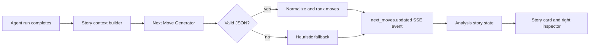

# Next Moves Design

## Purpose

This document defines the target design for intelligent Next Moves in
`databricks-builder-app-oai`.

The feature turns static follow-up buttons into context-aware recommendations.
Each recommendation should be a concise user-facing action that continues the
current chat and project workflow.

## Product Contract

Next Moves are generated after each completed story.

They should:

- estimate the user's likely next intent
- use the latest response, trace, and project context
- respect developer/user-preview/user role boundaries
- produce one-click prompts that can be sent directly
- avoid raw JSON, raw tool outputs, or trace internals in the UI
- degrade gracefully to deterministic fallbacks

They should not:

- perform actions automatically
- bypass approval policy
- expose secrets or Databricks tokens
- require the user to understand MLflow traces
- block the final answer for more than a short timeout

## Architecture



## New Backend Module

Add:

```text
databricks-builder-app-oai/server/services/next_moves.py
```

Responsibilities:

- define input and output dataclasses
- build compact context for generation
- call AI Gateway/OpenAI-compatible chat completions with
  `OPENAI_TITLE_MODEL` or `OPENAI_MODEL_MINI`, defaulting to
  `deepseek-v4-flash`
- parse and validate JSON output
- apply deterministic fallback heuristics
- normalize labels, prompts, action types, and confidence scores

## Runtime Integration

Current behavior emits static moves in `server/routers/agent.py` after the
`result` event. Replace that with:

1. Accumulate final text, trace steps, tool summaries, error state, and result
   metadata during the run.
2. On `result` or terminal error, build a `NextMoveContext`.
3. Start move generation with a short timeout.
4. Emit `next_moves.updated` when moves are ready.
5. If generation fails or times out, emit fallback moves.

The final answer should not wait for an expensive process. Target timeout:

```text
1.5s to 3.0s
```

The generator can run synchronously in the same background run coroutine because
it happens after the primary answer is complete. If latency becomes visible, it
can be moved into an async task that emits a late `next_moves.updated` event.

## Data Model

### Input

```python
@dataclass(slots=True)
class NextMoveContext:
  project_id: str
  conversation_id: str
  execution_id: str | None
  story_id: str | None
  run_role: str
  project_type: str | None
  project_status: str | None
  release_id: str | None
  question: str
  answer: str
  recent_messages: list[dict[str, str]]
  trace_steps: list[NextMoveTraceStep]
  evidence_summaries: list[str]
  effective_resources: dict[str, str | None]
  semantic_context: dict
  workflow_context: dict
  memory_context: dict
  error: str | None = None
```

```python
@dataclass(slots=True)
class NextMoveTraceStep:
  tool_name: str
  status: str
  summary: str | None = None
  duration_ms: int | None = None
```

### Output

```python
@dataclass(slots=True)
class NextMove:
  label: str
  prompt: str
  action_type: Literal['drill', 'compare', 'validate', 'explain', 'pivot']
  intent: str
  confidence: float
  requires_confirmation: bool = False
  source: Literal['model', 'heuristic'] = 'model'
```

The SSE event remains backward compatible:

```json
{
  "type": "next_moves.updated",
  "moves": [
    {
      "label": "Inspect catalog schemas",
      "prompt": "Show schemas and table counts for the matching _dev catalogs.",
      "actionType": "drill",
      "intent": "inspect_metadata",
      "confidence": 0.84,
      "requiresConfirmation": false
    }
  ]
}
```

The frontend can ignore unknown fields initially.

## Context Builder

The context builder should create a compact, safe packet. It must not include:

- raw tool JSON payloads
- Databricks tokens
- model API keys
- full MLflow trace payloads
- long answer text beyond a bounded limit

Recommended limits:

| Field | Limit |
|-------|-------|
| question | 1,000 chars |
| answer | 4,000 chars |
| recent messages | last 4 turns |
| trace steps | last 8 steps |
| evidence summaries | last 5 summaries |
| semantic context | selected project settings only |

## Prompt Design

The model prompt should be direct and restrictive.

System message:

```text
You generate concise next-step suggestions for a Databricks analyst/developer
agent UI. Return only JSON. Do not expose raw tool outputs. Do not suggest
actions that violate the user's role or project policy.
```

User message shape:

```text
Generate 3 next moves.

Use the current answer, project context, and trace summary to infer what the
user likely wants next. Prefer specific, useful continuations over generic
phrases.

Rules:
- Each label: <= 32 chars.
- Each prompt: a complete user message, <= 220 chars.
- Use actionType: drill, compare, validate, explain, or pivot.
- Avoid duplicate intents.
- If the answer failed, suggest recovery or narrowing steps.
- If the result is discovery metadata, suggest narrowing to schemas/tables,
  pinning defaults, or selecting assets.
- If the result is a metric, suggest comparison, segmentation, or validation.
- If the result is a build/deploy artifact, suggest preview, validation, or
  release steps.
- For read-only user roles, do not suggest write/deploy actions.

Return:
{
  "moves": [
    {
      "label": "...",
      "prompt": "...",
      "actionType": "...",
      "intent": "...",
      "confidence": 0.0,
      "requiresConfirmation": false
    }
  ]
}

Context:
...
```

## Model Choice

Use the cheap auxiliary model first:

```text
OPENAI_MODEL_MINI
OPENAI_TITLE_MODEL
deepseek-v4-flash fallback
```

Use the same OpenAI-compatible client pattern already used by
`server/services/title_generator.py`.

Rationale:

- Next Moves are metadata generation, not primary reasoning.
- They should be cheap and fast.
- Failures can fall back to heuristics.

## Heuristic Fallback

Heuristics should infer result type from question, answer, trace, and project.

### Discovery Results

Signals:

- question contains catalog, schema, table, volume, warehouse, cluster
- answer contains lists/tables of names
- trace used Unity Catalog or list tools

Moves:

- Inspect schemas
- Find useful tables
- Pin project defaults

### Metric Results

Signals:

- answer contains KPI, count, rate, revenue, ARR, DAU, MAU, conversion
- semantic context has metric views

Moves:

- Compare to prior period
- Break down by segment
- Validate metric definition

### Dashboard Or App Build Results

Signals:

- project type is Databricks app build or dashboard/report
- answer mentions dashboard, chart, app, component, deploy, publish

Moves:

- Preview as user
- Add validation checks
- Prepare release notes

### Data Quality Or Error Results

Signals:

- story status is error
- trace has failed tools
- answer mentions missing config, timeout, permission, not found

Moves:

- Retry with narrower scope
- Check project resources
- Inspect trace and logs

### User Preview / Read-Only Role

Signals:

- run role is `user_preview`, `user`, or `viewer`

Rules:

- Do not suggest creating, deleting, deploying, or mutating resources.
- Prefer explain, validate, compare, drill, and export/read-only analysis.

## Frontend Rendering

Frontend responsibilities:

- render moves from `next_moves.updated`
- preserve unknown output fields for future UI use only if needed
- keep a compatibility fallback for old conversations
- submit `move.prompt` as the next user message
- show moves in both story card and right inspector

Frontend should not be the main generator.

## Observability

Log:

- generator source: model or heuristic
- model name
- latency
- number of moves
- parse failures
- fallback reason
- project ID, conversation ID, execution ID, story ID

Persist as event metadata when possible:

```json
{
  "type": "next_moves.updated",
  "source": "model",
  "model": "deepseek-v4-flash",
  "latency_ms": 812,
  "fallback_reason": null
}
```

Do not log raw secrets or raw tool output.

## Evaluation

Add a small offline eval set with cases such as:

- catalog discovery
- schema/table discovery
- metric lookup
- anomaly investigation
- dashboard build
- project release
- permission error
- timeout/tool error
- user-preview read-only answer

Suggested scoring dimensions:

- relevance to latest answer
- specificity
- diversity of intents
- role/policy compliance
- prompt usability
- no raw JSON or trace leakage

The first implementation can use deterministic unit tests. Later phases can add
LLM-as-judge or human review in MLflow.

## Security And Policy

Next Moves are prompts, not actions. They should still respect policy because a
single click sends the prompt back to the agent.

Policy rules:

- write/deploy/delete suggestions require developer role and should set
  `requiresConfirmation=true`
- user-preview and viewer roles get read-only suggestions
- never include secrets, tokens, or raw credential-like strings
- avoid suggesting access to resources outside the project context unless the
  user explicitly asked for broader discovery

## Compatibility

No database schema change is required for MVP.

Existing `next_moves.updated` events continue to work. New fields are additive.
Existing frontend `NextMove` types can be extended without breaking old events.

## Open Questions

- Should Next Moves be persisted separately from stream events for later
  evaluation?
- Should users be able to dismiss a bad move and provide feedback?
- Should project workflows explicitly seed or override generated moves?
- Should the generator use a separate `OPENAI_NEXT_MOVES_MODEL`, or reuse
  `OPENAI_MODEL_MINI` / `OPENAI_TITLE_MODEL`?
- Should Next Moves include icons or tags beyond `actionType`?

